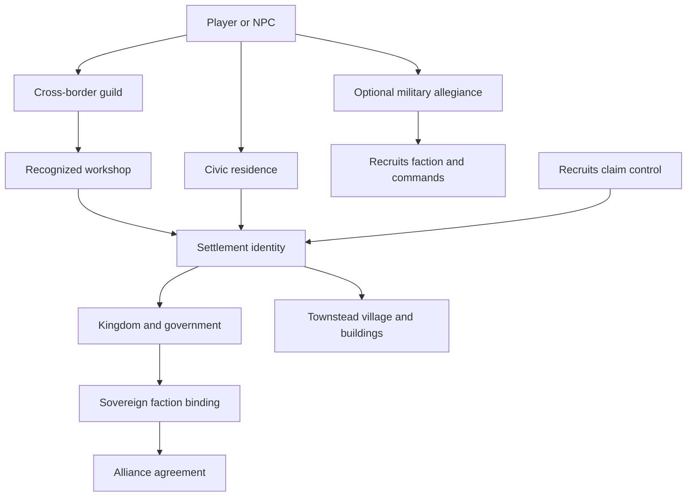
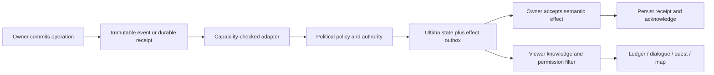
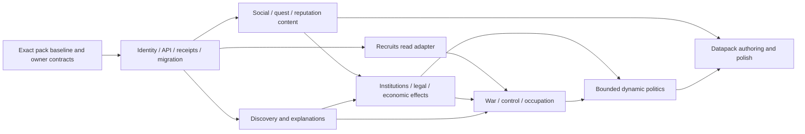

# Ultima Factions: pack integration audit and implementation roadmap

Implementation update: **R1 regional civic network is implemented and validated**; see [implemented behavior, provider delivery, validation and operational limits](R1-Civic-Foundation.md). No live pack release is implied by source implementation.

Audit date: **2026-09-20**. Audience: coding agents and pack maintainers. This is a design and implementation plan, not authorization to deploy its proposals.

**Recommendation:** evolve the existing faction service into a shared political context layer. Keep Ultima Kingdoms authoritative for civic identity and its existing government records; MCA/Townstead for people and settlements; MCA: Reputation for local social knowledge; MCA: Crime for legal cases; Recruits for military factions, combat diplomacy, claims and sieges; and the existing trading and progression mods for their own transactions. Factions should connect these owners through explicit, versioned contracts and authored consequences.

The first playable milestone should be a **regional civic network**: a settlement, its institutions, two neighboring political communities and a cross-border guild produce faction-aware conversations, contracts, introductions, service access and reputation explanations. Large-scale warfare is a later integration, not the prerequisite for factions becoming useful.

## 1. Current-State Audit

### 1.1 Scope, evidence and limitations

The audit examined the actual instance at `/home/otectus/Documents/curseforge/minecraft/Instances/Ultima`, this repository, relevant sibling mod sources, installed jar contents and selected bytecode signatures, scripts/configuration/custom data, and the existing instance log. No game instance, save, configuration or executable source was modified, and no game or build was launched for this audit. Documentation and inventory artifacts are the only deliverables.

Evidence labels used throughout:

| Label | Meaning |
| --- | --- |
| **Installed** | A jar/config/resource was present in the instance at audit time. This alone is not proof that every feature works. |
| **Observed** | The existing latest log records the operation or binding. It is not a new controlled runtime test. |
| **Source** | Verified in current source or installed bytecode; installation and runtime support are stated separately. |
| **Proposed** | New behavior or a new interface to implement. Names in proposed API/schema examples do not imply an existing API. |
| **Unverified** | Requires a focused probe, runtime test or provider change before implementation can rely on it. |

The complete top-level jar inventory accompanies this document in [ultima-factions-audit/mod-files.csv](ultima-factions-audit/mod-files.csv). The final inventory contains **332 active `.jar` files and one disabled jar**, with SHA-256, size and parsed top-level mod metadata. “Active” means an enabled filename, not proven runtime loading. Libraries, rendering fixes and bundled components need different treatment from gameplay systems. The significant gameplay families are evaluated in section 3. Inspecting every third-party implementation or certifying the full pack's runtime stability is outside the evidence obtained; unresolved behavior is a Phase 0 gate, not an assumed capability.

The initial inventory had 330 active jars. `daily_rewards_1.20.1-5.3.0.jar` and `chatnotify-forge-2.6.9+1.20.1.jar` appeared before the final inventory, checked at approximately **15:05 UTC / 11:05 EDT**. Their metadata is included, but neither is recorded in the inspected runtime log and no generated config was found for them. This audit did not install them. Metadata placeholders are retained explicitly in the CSV; Kotlin for Forge has no parsed top-level mod metadata and Realistic Wheat's TOML did not parse, so filenames/hashes remain the evidence for those rows. Nested dependencies are not counted as extra top-level files.

The repository targets **Minecraft 1.20.1, Forge 47.4.23, Java 17 and official mappings** in [gradle.properties](../gradle.properties) and [build.gradle](../build.gradle); the instance manifest also selects Minecraft 1.20.1/Forge 47.4.23. Its base commit is `fe05c7c952367d38e699e280f019cc7321ecfc64`, with substantial existing modified/untracked work. That working tree, rather than the base commit alone, was audited. Preserve it.

### 1.2 Installed and development state differ

| Component | Installed evidence | Implication |
| --- | --- | --- |
| Ultima Kingdoms | `ultima_kingdoms-0.1.0.jar`, SHA-256 `a5359f9ed0cf42a24ae68e2d2ddb78004f186bceed8f3973b69e081ff366a68b` | Contains faction standing and the political service; matches the documented political milestone. |
| Kingdom definitions | Installed jar contains Serenum, Lunari, Madera, Anemosia and Yew | Current source additionally contains Shimaguni. Do not promise six deployed kingdoms based on the README or unchanged version string. |
| MCA Reborn / Townstead | `7.6.26+1.20.1` / `0.7.6+1.20.1` | Actual log confirms MCA identity integration and Townstead read/reaction capabilities. |
| MCA: Quests / Conversations | `1.6.6` / `1.7.2` | Installed classes include `KingdomIntegration`, `FactionStandingReward` and `KingdomBridge`. The log confirms quest condition registration. |
| MCA: Reputation / Crime | `0.6.0` / `0.7.5` | Reputation contains the durable standing consumer and profile API; Crime provides a much broader legal model than a simple bounty counter. |
| Faction synchronization | Instance `config/ultima_kingdoms-factions-common.toml:4` is `SHADOW` | Outbox binding is observed, but projected local changes are not thereby live faction-score changes. Direct faction rewards are a separate path. |
| Recruits | `1.15.2`, SHA-256 `4b53c1b752e886ba10985aad2df30d668971810230eb77867e07428a21d1af7f` | Existing faction, diplomacy, claim, siege, embargo and world-map systems materially change the design. |
| Guard Villagers | Absent; latest log explicitly says integration skipped | Design primarily for MCA/Townstead guards and Recruits. Guard Villagers is optional compatibility, not a missing pack dependency to add automatically. |

The existing [political validation record](politics/validation.md) reports build/JUnit/GameTest, packaged-server and client checks for earlier hashes. Reuse that evidence only for its identified artifacts. This audit did not rerun those checks or establish that every subsequent source edit has equivalent validation.

### 1.3 What the pack is already trying to be

The installed content supports a social, exploration-heavy fantasy world: MCA people and Townstead villages; regional civic identity; layered quests, crime and reputation; Runic race/skill/god selection; several interoperating magic systems; skilled crafting and jewelry; seasons, food and environmental survival; Recruits military organization; dense villages/dungeons/bosses; and material travel and mapping.

Its strongest integration direction is therefore **institutions and obligations**, not universal stat bonuses. A town can need winter supplies, a guild can certify the supplier, a kingdom can recognize the guild, a priest can offer sanctuary, and a war can interrupt the route. Each system continues to do the job it already understands.

### 1.4 High-impact audit findings

1. **Identity is presently narrower than the requested design.** Faction standing uses `player UUID + kingdomId`; it has no general membership/rank/loyalty graph. Civic residence, political office and positive standing must not become implicit enrollment.
2. **Infrastructure is ahead of faction-aware authored content.** Searching installed MCA Quests/Conversations JSON for `kingdom_lifecycle`, `kingdom_gate`, `ultima_kingdoms:standing` and `ultima_kingdoms:faction_standing` found their schemas, not authored uses in those jars. A content search across `kubejs/data` also found no uses of those fields/IDs. The pack nevertheless has extensive existing civic/arcane/exploration stories to adapt.
3. **Politics already exists.** Capitals-inspired governments, capitals, offices, mandates, petitions, honors, institution recognition, peaceful agreements and named succession are implemented. Do not propose rebuilding them. Commissions and Chronicles ingestion are explicitly unavailable in that implementation.
4. **Recruits already owns much of the requested warfare scope.** A second team, claim, siege or hostility implementation would create contradictory behavior and administrative burden.
5. **Local reputation already has social memory and profiles.** Recognition, facets, personal opinion, incident knowledge and attribution are available in MCA: Reputation. Factions should not create a second generic NPC gossip simulation.
6. **Discovery is not yet a shared privacy rule.** `NetworkHandler.handleLedgerRequest` pages global known settlement records without a viewer discovery predicate; `SettlementSummary` includes coordinates. Existing private political page authorization does not solve this separate exploration issue.
7. **Currency is not safe to assume from filenames or source checkouts.** Actual installed trade configuration and per-world Recruits currency settings must determine the economic adapter. A Numismatic/CustomTradeCurrency design cannot be assumed installed.
8. **Performance requires attention before expansion.** The standing outbox is polled on server ticks, discovery is bounded, and Townstead reactions are locally bounded. Recruits chunk loading is enabled in the sampled recent world; adding patrols without a budget would compound an existing cost.

Source anchors: [faction API](../src/main/java/com/ultimakingdoms/api/factions/UltimaFactionsService.java), [standing implementation](../src/main/java/com/ultimakingdoms/factions/FactionServiceImpl.java), [outbox](../src/main/java/com/ultimakingdoms/compat/reputation/ReputationOutboxBridge.java), [government implementation](../src/main/java/com/ultimakingdoms/politics/GovernmentService.java), [ledger networking](../src/main/java/com/ultimakingdoms/network/NetworkHandler.java), [ownership agreement](politics/ownership.md).

### 1.5 Research tasks that block dependable implementation

**A01 — Freeze the integration baseline. P0; complexity M.** Capture hashes, effective per-world configs, loaded mod IDs, enabled data/resource packs, and provider capability reports in a disposable copy. Identify which installed versions match sibling source. Build a positive/negative capability matrix rather than using version ranges as support claims. Do not update mods as part of the audit. Dependency: none. Acceptance: a coding agent can reproduce the selected tuple and distinguish `ABSENT`, `DISABLED`, `UNSUPPORTED`, `UNLOADED`, `READY` and `FAILED`.

**A02 — Establish authoritative ownership. P0; complexity M.** Before enabling new effects, write the provider ownership table in section 5 into configuration and diagnostics. Default Recruits mappings to read-only observation; legal and economic mutations remain disabled until their provider contract is verified. Multiplayer: one server-side selected writer per operation. Acceptance: two providers cannot simultaneously own claim transfer, criminal credit, reward payment or military hostility.

**A03 — Baseline pack health. P0; complexity M.** Existing logs contain JEI recipe/plugin errors and an Iron's Spellbooks/Map Atlases lectern mixin overwrite conflict. Reproduce relevant failures in the copied tuple before relying on affected stations or UI; they are observations, not established causes of faction bugs. Separate pre-existing failures from integration regressions. Configuration: diagnostic verbosity and disabled-adapter reasons. Dependency: A01.

### 1.6 Pack-owned content and effective configuration

`kubejs/data` contains **1,403 files**, and `kubejs/assets` contains **12,981 assets**. Under the `ultima` namespace are 221 dialogue files, 191 attachments, 186 genes, 160 RPG Lore books, 140 MCA quest definitions, 101 loot tables, 98 Treasure Bags types, and 54 each Root/ancestry files. Counts describe files, not proven successfully applied registrations. The existing log records three startup scripts, two client scripts and three server scripts loading without KubeJS script errors. The selection bridge validates 54 race/Root mappings at runtime (`latest.log:87802`).

| Existing authored content | Audit result / design use |
| --- | --- |
| Civic quests: Hearth Pantry 12, Lamplighters 8, Ironwright 10, Infirmary 8, Saltmere 10 | Ready-made institutional identities; add sponsor, standing and political context without changing unrelated objectives. |
| Arcana: Stonecrown Routes 10, Ironbound Collegium 10, Green Compact 10, Sexton's Watch 10, Winter Roads 8 | Seed colleges, orders and research compacts with alternatives across magic systems. Names alone do not establish present faction entities. |
| Expeditions: Border Watch 12, Fieldbook 10, Eight Vaults 14, Last Horizons 8 | Use for survey/defense/intelligence and boss-related civic outcomes. |
| RPG Lore: 51 histories plus Cataclysm, folk, beasts, arcana, gods/towers, journals and wilds | Preserve existing canon and acquisition rules; add explicit political references and historical provenance. |
| `civic/saltmere/coin_that_swims.json` | A once-only fisherman quest to obtain `tide:midas_fish`, rewarding MCA currency, 30 XP and three hearts; no faction effect. Keep its fish-preserving narrative/turn-in behavior when adding an institutional acknowledgment. |
| KubeJS selection bridge | Synchronizes Runic Race, Townstead Root and MCA appearance. No faction ownership should be inserted into this identity synchronization. |
| `treasure_bags_chests.js` | Injects weighted bag pools into structure loot; reuses existing exploration rewards. “Purse of Coins” content can contain `block_factorys_bosses:coin_pile`, not Dot Coin wallet tender. |
| Top-level and discovered world `datapacks/` | No files found. This does not mean the pack lacks datapack content: mod resources and KubeJS data are substantial. |
| Resource-pack archives | Eight are present; none appears in `options.txt`'s enabled archive list. Enabled entries are vanilla/mod/generated packs and two Jaden's Nether Expansion packs. Do not promise optional clothing/heraldry art is visible. |

MCA Quests enables default quests, village projects, reputation tiers and situations. The existing log reports **21 definitions hidden because they cannot currently finish with the loaded Townstead**, including unsupported trade progression requirements (`latest.log:86560`, `86567` onward). Do not make these mandatory promotion prerequisites before fixing/verifying their content.

The log also reports missing entity references in `ultima:arthropod`, `ultima:undead` and `ultima:elite`, including `rottencreatures:flying_scarab` and `cataclysm:nameless_sorcerer` (`latest.log:24389` onward). Revalidate these tags before using them for faction hostility or objective eligibility. Do not silently substitute all mobs of a broad species.

Dot Coin `config/dcm.json` enables copper/iron/gold/platinum, a conversion rate of 10, wallet UI/autopickup, mob/chest coins and death drops. MCA Quests uses vanilla emerald currency; the authored `config/custom trades/armorer.json` also uses emerald/barter trades. Dynamic Villager Trades and Villager Trading Plus contribute their own behavior. This is a mixed economy with active money content, not an already unified currency contract. Stale Guard Villagers configuration and enabled optional FTB Quests settings are not evidence that those absent mods are running.

Primary pack evidence: [custom quest](</home/otectus/Documents/curseforge/minecraft/Instances/Ultima/kubejs/data/ultima/mcaquests/quests/civic/saltmere/coin_that_swims.json>), [Dot Coin config](</home/otectus/Documents/curseforge/minecraft/Instances/Ultima/config/dcm.json>), [selection bridge](</home/otectus/Documents/curseforge/minecraft/Instances/Ultima/kubejs/server_scripts/ultima_selection_bridge.js>), [latest runtime log](</home/otectus/Documents/curseforge/minecraft/Instances/Ultima/logs/latest.log>), [enabled resources](</home/otectus/Documents/curseforge/minecraft/Instances/Ultima/options.txt>).

## 2. Existing Ultima Factions Capabilities

Ultima Factions is currently a **module inside `ultima_kingdoms`**, with a public `com.ultimakingdoms.api.factions` facade. There is no need to invent a separate installed mod ID or move saves to a new mod as the first step.

| Capability | Current behavior | Preserve / extend |
| --- | --- | --- |
| Service lifecycle | Server-scoped `UltimaFactionsApi.get(server)`, API version 1, server-thread access | Preserve old callers; add contracts rather than changing old method meaning. |
| Political standing | Persistent score, tier, high-water tier and revision per player/kingdom | Keep this as sovereign standing; add generic faction subjects separately. |
| Mutation provenance | Cause, source, correlation UUID, source revision, optional settlement/description and quiet flag | Extend to structured evidence and recipient-specific effect IDs. |
| Replay protection | Correlation receipts, source checkpoints, durable cursor and held pending mappings | Reuse; specify ordering domains before adding multiple producers. |
| Scope predicates | `LOCAL`, `FACTION`, `EFFECTIVE`, `EITHER`, `BOTH` | Unknown local evidence remains unavailable, not neutral. |
| Effective score | Local score plus capped faction overlay; default cap 50, effective clamp −1000..1000 | This is a query projection, not a replacement local ledger. No automatic money/damage effects follow from it. |
| Sync modes | `OFF`, `SHADOW`, `MCA_TO_FACTION`, `BIDIRECTIONAL_SEMANTIC` | Stage rollouts in shadow; reverse effects must remain explicit semantic deliveries. |
| Migration | Preview/import local baselines with aggregation and unmapped/conflict reporting | Default mean; do not silently sum many villages into fame. |
| Reassignment policy | Frozen historical attribution | Conquest must not credit old deeds to a new ruler. |
| Events | `FactionStandingChangedEvent`, mirrors | Add membership/diplomacy/territory events only after authoritative commits. |
| Quest bridges | Ultima kingdom gate registration plus MCA Quests native standing condition, standing reward and lifecycle support | Author real content and extend with generic faction context. |
| Conversation bridge | Optional kingdom/standing predicates in MCA Conversations | Add membership, public treaty and known-news predicates through its normal context pipeline. |
| Townstead bridge | Villager/calendar/building/origin/gene/spirit reads, building binding/recovery, reactions, civic Blueprint header | Respect capability failures and loaded-evidence limits. |
| Politics | Capitals, offices, mandates, petitions, recognition, honors, agreements, succession and house labels | Add typed queries/effects to this service; do not mirror mutable government state into Factions. |

Standing tiers are currently hardcoded in `FactionTierScale`: enemy below −300, hostile from −300, unfriendly from −100, neutral from −24, trusted from 100, honored from 300, exalted from 700. These are **reputation bands, not organizational ranks**. Existing faction commands require operator level 2; ordinary players need a read-only standing/membership explanation UI.

Townstead's standing reaction dispatch caps accepted targets at 32 near the player (24-block radius), and settlement reassignment dispatch at 64 residents. It does not constitute durable news delivery to unloaded NPCs. Its building reconciliation defaults to 200 ticks and 32 active settlements. The reputation outbox requests batches of 64; future optimization must preserve save-before-ack behavior.

Missing today: general faction definitions, voluntary membership, NPC political loyalty, organizations containing kingdoms, general treaties with operational effects, an integrated Recruits authority adapter, faction-specific law policy, transactional trade policy, discovery-aware political intelligence, durable faction news, and authored multi-system faction content.

## 3. Mod-by-Mod Integration Matrix

The matrix evaluates gameplay responsibility, present faction interaction, usable seams, worthwhile behavior and explicit limits. **N** means no direct Ultima Factions adapter found in the inspected core/related sources; it does not claim that all third-party code was exhaustively searched. **I** means an existing integration; **S** means sibling source capability; **O** means optional/absent. Proposed seams require A01 before use.

| Mod / subsystem | Contribution and current connection | Shareable data / concrete integration | Limits; roadmap |
| --- | --- | --- | --- |
| **Ultima Kingdoms + native politics** | I: civic identity, standing and governments | Stable settlement/citizen refs; offices, mandates, accepted agreements, committed events | Preserve existing service/save ownership; B01–B04, K01–K04; P0/P1 |
| **MCA Reborn 7.6.26** | I: people, relationships, family/home | UUIDs, civic evidence, relationship context; institutional roles and introductions | No family/name/genetic rewrites or destructive conversion; S01–S04; P1 |
| **Townstead 0.7.6** | I: settlement work, needs, buildings, skills, reactions | Existing facade snapshots, building binding/recovery, calendar/spirit; recognized institutions and civic projects | No parallel schedules/building simulation; unsupported Chronicles/commissions remain unavailable; K02, Q02; P1 |
| **MCA: Reputation 0.6.0** | I: local standing outbox; profile/opinion/knowledge APIs | Durable standing envelopes, semantic delivery, receipts, profile facets, observer knowledge | Do not collapse affection, recognition and standing; R01–R02; P0/P1 |
| **MCA: Conversations 1.7.2** | I: kingdom/standing gates | Topic/branch context, existing dialogue catalogs, gossip speaker context | Add contextual lines and secure actions; do not create another chat engine; S02, U03; P1 |
| **MCA: Quests 1.6.6** | I: conditions/rewards/lifecycle and building context | Objective/condition/reward registration, acceptance/completion events, projects | Reuse journals/turn-in and existing 140 pack quests; receipt gaps need extension; Q01–Q04; P1 |
| **MCA: Crime 0.7.5** | N direct; existing MCA/Rep/Townstead integration | Public case/custody views; report, warrant, fine, fence and resolution events | Crime owns law enforcement and inventories; L01–L04; P1/P2 |
| **MCA Mob Compatibility 0.2.0** | N direct; entity-role/guard compatibility | Existing role tags and optional guard identity/events | Real entity UUID, preserve families/owners; guard conversion protections remain; S01, W04; P1 |
| **Recruits 1.15.2** | N; substantial native factions/claims/warfare | Verified installed managers/events for faction, diplomacy, recruits, claim and siege | Primary military/control provider, not a replaceable troop library; W01–W04, R04; P0/P2 |
| **Recruits Skins 0.2.0** | N; current faction/team/role selectors | Rule-based unit visual identity and uniforms | Cosmetic projection only, no authority from skin; W03; P1 |
| **Livestock × Recruits / Recruits Corpse Patch** | N; military mount/death compatibility | Provider mount ownership and corpse identity | Keep transport/equipment recovery owner; no duplicate corpse handling; W04; P1/P2 |
| **Runic Skills 2.2.1** | N direct; existing progression cross-mod hooks | Skills/perks/item restrictions, event/snapshot adapter after jar probe | No new XP system or level writeback loop; M01; P1 |
| **Runic Races 1.7.1 + Origins** | N direct; active selection bridge | Race ID/family, capability state, racial targeting event where supported | Race is not allegiance; preserve 54 Root mappings; M04; P1 |
| **Runic Gods 0.2.1** | N; worship and divine encounter owner | Public deity/favor/tier reads and worship/boss events, subject to installed probe | No forced conversion or duplicate divine favor; M03; P1 |
| **RPG Lore 2.2.0** | N; 160 pack books, political canon | Book IDs/tags/acquisition; first-collection event if installed API supports it | Lore source may be biased; book item is not permission; M05, X04; P1 |
| **KubeJS / Rhino / pack data** | I indirectly through race/root selection; faction content absent | Tags, recipes, loot, dialogues and quest/lore definitions | Content/glue only; durable rewards/authority in owning services; API03; P0/P1 |
| **Dot Coin 20.18.1** | N; active coins and wallet | Coin registry/config, wallet/debit/credit contract to investigate | Actual provider for coin channel; no automatic emerald integration; E01–E02; P0/P2 |
| **Custom Villager Trades 20.25.0** | N; authored trade catalog | Existing profession offers and replacements | Preserve emerald/barter values; per-player price hook unverified; E01–E02; P1/P2 |
| **Dynamic Villager Trades / Villager Trading Plus / Hero of the Village +** | N; trade variability, controls and enhanced master offers | Trade/reputation policies and offer metadata | Inventory every modifier before tariff/discount stacking; E02; P0 audit/P2 |
| **More Villagers / Villagers Plus / Chef's Delight / TaxDeepVillager** | N; additional professions, trades and village content | Profession IDs, workstations and recipes for institution-specific jobs | Actual installed IDs/roles need registry validation; do not replace profession progression; K02, Q01; P1 |
| **Bountiful 6.0.4 + Extra Bounties** | Existing MCA Quests adapter, no direct faction sponsor layer | Boards, pools/decrees, capability-checked successful cash-in observer | General contracts, not Crime warrants; unique reward receipts before political credit; Q04; P1 |
| **Daily Rewards 5.3.0** | N; present only in final inventory, no observed runtime/config | Optional delivery of ordinary supplies after its reward transaction is verified | Do not equate login streaks with political service, rank or authority; include in reward/currency audit; E01, R01; P0 audit/P3 content |
| **Iron's Spellbooks 3.16.3** | N; spells, schools, gear, encounters | School/item tags, stations and validated cast/kill attribution | Own spell access/mana; forbid automatic law based merely on school identity; M02, W03; P1/P2 |
| **Ars Nouveau 4.12.7** | N; spellcraft, source, rituals/automation | Research tasks, ritual components, groves and crafting evidence | No second spellbook/unlock tree; M02; P1 |
| **Botania 456** | N; mana and magical production | Botanical research, production commissions and ritual facilities | Own mana/recipes; no faction-side machine simulation; M02, E03; P1 |
| **Ars N Spells / Ars Botania / Iron's Botany** | N; existing magic interoperability | Reuse established recipe/magic pathways for shared institutions | Do not bypass their conversion/balance contracts; M02; P1 |
| **Magic NPCs 0.9.1** | N; configured spellcaster behavior/loadouts | Faction archetype loadout mappings and a proposed relation policy hook | No verified public faction API; preserve its casting/AI owner; W03; P2 |
| **Tinkers Construct + Mantle + leveling/jewelry/katana/rapier addons** | N; deep artisan equipment production | Material/item tags, crafted component evidence, workshop services | Runic restrictions and native crafting remain; no duplicate item variants per faction; E03, M01/M05; P1 |
| **Jewelcraft Reforged 1.0.0** | N; jewelry, Jeweler Bench and effects | Crafting event/recipes, commission evidence, ceremonial signets | No verified faction API; server-issued credentials separate from jewelry; M05, E03; P1 |
| **Apotheosis / Apothic Attributes, Curios, accessories and compatibility addons** | N; loot affixes, gems, enchantment/gear progression | Bounded certification/recovery contracts and rarity/item tags | No multiplicative bonus pile or faction bypass to item gates; M01/M05; P1 |
| **Better Combat / Spartan equipment / archery addons / Tinker Better Combat** | N; combat rules and weapon variety | Damage owner/context, protected-target policy and troop equipment | Do not replace attacks or stack generic faction damage; W03; P1/P2 |
| **ParCool, Pehkui and movement/flight helpers** | N; traversal and body-scale mechanics | Scout routes, rescue access and noncombat alternatives | Test reach/checkpoint assumptions; no blanket traversal denial; Q02, X05; P2 |
| **Cataclysm + dimension/fortress/summon/rise/loot addons** | N; boss/structure progression | Real encounter IDs, structures, summons, participation and loot | Summon/farm attribution, no instant annexation on boss death; X04; P1/P2 |
| **Mowzie's Mobs + Respawner / Bosses of Mass Destruction / Block Factory's Bosses** | N; distinctive enemies/boss sites | Site contracts, confirmed encounter completion and artifact research | Distinguish one-time story from repeatable boss rewards; X04; P1 |
| **DailyBoss and integrations / Progressive Bosses** | N; repeatable/escalating encounters | Campaign participation with explicit repeat and contribution budgets | Provider progression is not political authority; X04, R01; P1 |
| **Lycanites alpha + Delight / Legendary Monsters, Creatures and additions** | N; diverse ecology, threats and resources | Validated entity/item tags, regional hazards, rescue and bestiary research | Alpha registry churn and broken pack tags; never assume all creatures are a nation; X04; P0 audit/P1 |
| **Alex's Mobs + interaction/tweaks/cuisine / Creeper, Spider and Rotten Creatures / Special Mobs / Variants** | N; ecology/combat variety | Conservation, bounty and settlement-defense tags | No all-entity per-tick faction scan; habitat-based content without universal hostility; X04; P1 |
| **DragN livestock/pets / Saints Dragons / Tameable Beasts / Tiny Dragons / Pet Transfer** | N; animals, companions, mounts | Existing owner/tame/rider evidence, transport and rescue jobs | Never confiscate/retarget pets by species or territory alone; W04, E04; P1/P2 |
| **Farmer's Delight, Brewin' and Chewin', Cultural/Fruits/Tide/other Delight addons, Tide fishing** | N; food, drink and regional production | Ingredient tags/recipes and actual delivery for feasts, relief and trade | Let food providers own nutrition; no infinite prestige from common crop crafting; C03/C10, E03; P1 |
| **Serene Seasons / Legendary Survival Overhaul** | Existing companion context, no direct faction layer | Calendar/weather/survival evidence for preparation/aid contracts | Do not fake shortages or erase temperature/thirst with political buffs; E03, M03; P1 |
| **Plant Fiber, farming/tree/harvest helpers, Hardcore Torches, Unlit Campfire** | N; material and survival logistics | Fiber, fuel and lighting commissions; Lamplighter civic content | Automation/repeat credit caps; preserve survival pacing; C01/C03, E03; P1 |
| **Regions Unexplored + expansion / Traverse / Jaden's Nether Expansion** | I via kingdom biome tags only where definitions map them; otherwise N | Biome/style/context tags for regional culture, resources and travel | Biome classification never equals conquest/control; X02; P1 |
| **Moog's Missing Villages / Sky Villages / Underground Villages variants / Improved Village Placement / Luki's Grand Capitals** | Possible generic village-tag discovery; no bespoke adapter found | Structure recognition, civic names, provider settlement bindings | Verify tags/POIs; Luki's worldgen is not MCA Capitals governance; X02, K01; P1 |
| **Dungeons Arise + Seven Seas / Dungeons & Taverns / Awesome Dungeon / Much More Dungeons / Puzzle Dungeon / Underground Rooms** | N; exploration sites | Existing structure/loot tables for surveys, hostile outposts and recovery | Add metadata after discovery, no destructive retrogen; X02/X04; P1 |
| **YUNG's structures / Luki's strongholds and mansions / Medieval Buildings/Nether/End** | N; ruins/landmarks and adventure spaces | Heritage, pilgrimage, defense and archaeology content | Monument style is not current ownership; X02–X04; P1 |
| **Brass-Amber BattleTowers / Ancient Obelisks / End Remastered + extension** | N; staged tower/End exploration | Existing tower/eye/landmark objectives, lore and shared research | Do not hard-lock End keys behind permanent membership; X04, M05; P1 |
| **Dungeon Realm / The Harvest / Cataclysm Dimension** | N; dimension/adventure progression | Expedition commissions and instance-scoped discovery | Avoid persistent claims in reset/deleted instance dimensions; X05; P0 contract/P2 |
| **Locks Reforged / Simply Traps** | N; access protection and defensive hazards | Provider lock ownership, legal entry, authorized sabotage/locksmith contracts | A lock is not sovereignty; Crime owns theft attribution; L03, X02; P1/P2 |
| **Lootr / Treasure Bags / pack loot injection** | N; personal/shared loot and structured rewards | First-discovery/provenance signals and eligible loot tags | Never turn personal loot into a shared treasury or duplicate bag credit; E03, X04; P1 |
| **Corpse + Curios/cosmetic compatibility** | N; death recovery | Identity-preserving rescue/repatriation contracts if events support them | Own death inventory and recovery rules; no faction confiscation; W04, Q02; P2 |
| **Sophisticated Backpacks / Storage / inventory helpers** | N; inventories/automation | Authorized provider inventory operations at contract commit | No global inventory scans or unauthorized warehouse withdrawals; E03, L03; P1/P2 |
| **Waystones / Map Atlases 6.0.20 / a2w / Telepass** | MCA Quests maps and native atlas-waystone compatibility | Discovery-aware services/routes; existing waypoint presentation | Test atlas/lectern conflict, don't reveal bases or strand travelers; X01/X05, U04; P1/P2 |
| **Supplementaries / Macaw's building family / Twigs / furniture, lighting, workbench addons** | N; material identity and architecture | Signs, banners, furnishings, institutional requirements and commissioned builds | Reuse models/blocks; avoid fake building completion from block count alone; X03, K02; P1 |
| **FTB Teams + FTB Library** | Installed; no direct faction integration | Explicit optional party/share context | Party is not citizenship, quest author or sovereign; FTB Quests/Chunks absent; P01, Q01; P1 |
| **JEI / Jade / professions/resources viewers / guide books / Loot Journal** | N; information/UI | Context tooltips and recipe/service explanations | Do not leak private data; fix existing relevant plugin errors first; U01–U03; P1/P3 |
| **Chat Notify 2.6.9** | N; present only in final inventory, metadata describes mention/custom alerts | User-selected political notification preferences after runtime verification | No direct faction dependency needed; avoid pinging every member for routine events; U03; P3 |
| **Performance, graphics, audio and library mods** | No political role required | Profiling, accessibility and existing notification/rendering infrastructure | Keep untouched unless a measured integration conflict; do not invent political mechanics for them; A03, section 19 |
| **Guard Villagers, FTB Quests, JourneyMap/Xaero, MineColonies/MCA Colonies, MCA Capitals** | O: absent from current active inventory | Future adapters only when installed; existing companion source may support some | Do not add these dependencies to make the plan work; Capitals conflict guard already exists; P3 |
| **CustomTradeCurrency, Effective Instruments, HolyCraft, MassMagicka** | O/S: sibling sources, absent current jars | CTC conversion events or EI faction-provider seam may help future optional packs | No claim of current integration; HolyCraft could duplicate Runic worship; P3 |

Most production/crafting integration can use existing tags, recipes and quest evidence; only policy at an actual transaction/AI boundary needs a Java adapter. Performance/rendering libraries are accounted for by the inventory and compatibility testing, not assigned artificial faction features.

## 4. Missing Integration Opportunities

Prioritize closed gameplay loops whose outcomes can be explained and tested.

| ID | Opportunity and proposed loop | Priority / complexity | Dependencies |
| --- | --- | --- | --- |
| C01 | **Institution sponsorship:** Townstead workshop → profession quest → verified delivery → guild standing → political recognition → access to another town's workshop | P1 / L | A01–A02, identity/policy API, quest receipts |
| C02 | **Local trust versus national distrust:** disliked outsider earns a village advocate through rescue/restitution; personal affection opens mediation without clearing a legal warrant | P1 / M | Reputation views, Crime public view, conversation gates |
| C03 | **Winter compact:** seasonal demand → food/fuel/textile contracts → voluntary transport → receipt-backed civic honor; sanctions can exempt relief supplies | P1 / L | Townstead buildings, seasons, quest/economic provider |
| C04 | **Frontier expedition:** discovered ruin → survey commission → boss hazard → route intelligence → shared research access, with treaty-limited map sharing | P1 / L | Discovery, quests, boss credit |
| C05 | **Merchant murder:** Crime's attributed case identifies a guild-affiliated victim; the guild suspends brokerage while the local court handles the warrant | P1 / M | Case attribution, NPC affiliation, no duplicate standing credit |
| C06 | **Occupation without cultural erasure:** Recruits siege changes controller; residence, origin, names and families remain; autonomy negotiation determines services and loyalties | P2 / XL | Recruits bridge, settlement binding, law policy |
| C07 | **Religious refuge:** temple recognition and an actual asylum agreement permit sanctuary services, while extradition remains a separate legal decision | P2 / L | Religion evidence, treaties, Crime extension |
| C08 | **Underground survivors:** defeated political organization becomes a landless movement with supporters, recovery quests and a negotiated amnesty route | P2 / XL | Lifecycle, membership history, occupation, event director |
| C09 | **Uncertain attribution:** masked theft generates a local case and rumor, then corrected evidence changes political consequences; no omniscient faction penalty | P2 / L | Crime masks/reports, Reputation supersession, evidence propagation |
| C10 | **Cultural diplomacy:** festivals, cuisine, music, craft gifts and archival recovery support peaceful careers and introductions | P1 content / M; richer simulation P3 / L | Provider-confirmed contribution and conversation content |

Avoid an implementation that technically registers 30 adapters but gives the player no legible reason to use them. Each released integration needs an entry point, a decision, an observable result, a recovery path and an explanation of which institution reacted.

## 5. Faction Architecture Improvements

### 5.1 Compare the architectural options

| Approach | Strength | Failure mode | Decision |
| --- | --- | --- | --- |
| Make factions identical to kingdoms/Recruits teams | Small first implementation | Cannot represent guilds, religions, independent towns, dual loyalty or political occupation | Reject as the general model; retain an explicit sovereign-faction binding for compatibility. |
| Replace all providers with a universal faction simulation | Centralized logic | Duplicates mature AI, crime, money, settlement and claim systems; breaks save ownership | Reject. |
| Loose scripts that copy values between mods | Fast content experiments | Feedback loops, restart duplication, hidden authority and event-order bugs | Use only for noncritical content selection, never as the transaction backbone. |
| **Typed domain services plus provider adapters** | Separate responsibilities, optionality, stable external queries, incremental delivery | Requires explicit mappings and capability negotiation | **Recommend.** Keep current modules and extend their contracts. |

### 5.2 Responsibility and authority table

| State / operation | Authoritative owner | Ultima Factions role |
| --- | --- | --- |
| Settlement UUID, civic name, origin/residence, kingdom assignment | Ultima Kingdoms | Resolve stable references; publish political interpretation. |
| Kingdom government, offices, mandates, capital, accepted peaceful agreements | Existing Ultima political service | Query and request validated actions; retain one government record. |
| NPC family, hearts, home, profession, needs, schedule, building reality | MCA/Townstead | Consume snapshots; store only explicit political affiliations/loyalty. |
| Local standing, public profile, opinion, incident knowledge | MCA: Reputation | Consume evidence and deliver authorized political incidents through its API. |
| Crime detection, witnesses, cases, warrants, stolen property, sentences, custody | MCA: Crime | Supply treaty/jurisdiction policy through a proposed extension; never clear raw heat as a pardon. |
| Military team, soldier owner, battle hostility, physical claims and siege outcome | Recruits for mapped military domains | Observe first; request operations through a tested adapter; add civilian consequences. |
| Nonmilitary memberships, organizational ranks, cross-kingdom affiliations | Expanded faction service | Own directly. |
| Quest progress and completion/reward transaction | MCA: Quests; Bountiful owns its own cash-in | Supply predicates and effects; consume committed receipts. |
| Currency, trader inventory, exchange and debit/credit | Selected installed economy/trade provider | Negotiate access and policy; never mint a parallel currency ledger. |
| Race/root, skill progress, worship, mana, crafting recipes | Their existing providers and pack selection bridge | Read eligibility; grant access to institutions/contracts, not overwrite progression. |
| Discovery and political intelligence | New Ultima knowledge service, consuming map/discovery evidence | Filter all new Ultima output by viewer entitlement. |

**B01 — General faction identity and affiliation. P0; L.** Introduce namespaced definition IDs and persistent instance IDs for founded organizations. Preserve existing kingdom IDs as sovereign faction aliases. Support typed membership edges for persons, kingdoms and institutions; do not use display names, scoreboard colors or current biome as keys. Configuration: allowed faction kinds, membership slots/conflicts, founding limits and naming policy. Multiplayer: every mutation authenticates the actor, scope, revision and faction policy; NPC enrollment cannot be claimed by arbitrary player packets. Dependencies: A01–A02. Acceptance: a player can live in one kingdom, work for a transnational guild and have no military team; each remains independently queryable.

**B02 — Typed permissions and relation composition. P0; L.** A rank can grant institution-specific permissions; a kingdom mandate grants government authority; a Recruits owner/rank grants troop command. None automatically grants the others. Evaluate policy as a reason-bearing result with expiry and evidence, not a boolean cached forever. Separate diplomatic recognition, military hostility, trade access, safe passage, intelligence sharing and legal cooperation. Configuration: policy precedence and unsupported-operation fallback. Multiplayer: deny authority on absent/unknown provider data, but keep ordinary provider gameplay available. Dependencies: B01 and government queries.

**B03 — Semantic event delivery. P0; L.** Build on existing receipts/outbox rather than replacing them. Commit owner state, publish immutable evidence, enqueue recipient-specific effects and acknowledge durable consumption. A live Forge event is a notification, not proof of crash-safe delivery. Extend producers lacking durable receipts before enabling irreversible rewards. Configuration: queue/retention/retry budgets, dead-letter limits and health reporting. Multiplayer: persistent server clock and per-subject revision, no client-supplied outcomes. Dependencies: A02. Acceptance: crash/restart, duplicate callback and provider reload apply each effect once within its documented delivery contract.

**B04 — Domain health and explainability. P0; M.** Expose `/ultima integrations status`, proposed `/ultima faction explain` and structured provider status pages. Identify disabled effects, unresolved mappings and conflicting authorities. Do not convert unavailable evidence into a known neutral status. Dependencies: B01–B03. Acceptance: an operator can diagnose why a trader, guard or quest treated a player a certain way without editing NBT.

## 6. NPC & Social Integrations

**S01 — Political identity without replacing personhood. P1; L.** Store a sparse affiliation record keyed by NPC UUID: organization, relationship type, rank, appointment provenance, voluntary/assigned status and revision. Civic residence and origin remain separate provider references. A resident need not support the ruler, a guard's employer need not be their birthplace, and a merchant can belong to a transnational guild. A loyalty tendency describes willingness to serve, not friendship or a replacement personality. Seed only authored/explicit roles; do not enroll every villager into every inferred faction on chunk load. Mods: MCA, Townstead, Ultima, optionally Recruits. Hooks: civic residence events, provider employment/hire events, explicit appointments and NPC removal; Recruits remains owner of soldier employment. Configuration: seed policies, supported NPC types, maximum affiliations, visible versus private roles. Multiplayer: server-only private loyalty; clients receive only entitled public labels. Dependencies: B01–B04. Acceptance: moving home preserves family, hearts, origin and prior voluntary guild membership.

**S02 — Context-aware dialogue and social knowledge. P1; M/L.** Extend MCA Conversations' existing `KingdomBridge`/`KingdomGateSpec` with a proposed faction context query containing public allegiance, relevant standing, institution role, public treaty status and *news this speaker knows*. Add authored lines to its normal topic, branch and fallback machinery, including packet entry points. Reuse MCA Reputation `speakerContext`, `villagerKnows`, `gossipStory` and detailed opinion/profile queries. Never turn every NPC into an omniscient political terminal. Townstead reactions may express a known event; their dispatch is not a durable memory receipt. Configuration: gossip radius/knowledge policy, salience threshold, frequency limits, neutral fallback lines, notification language. Multiplayer: recheck the selected dialogue action server-side; filter secret roles before constructing context. Dependencies: S01, R01–R02, B03. Acceptance: an informed recruiter discusses a war; an isolated villager without knowledge does not; both retain personal opinions of the same player.

**S03 — Recruiters, envoys, advocates and institutional careers. P1; M.** Use MCA/Townstead NPCs with secondary political roles: recruiter, diplomat, guild examiner, temple steward, legal advocate or archivist. A role opens existing conversation/quest options; it need not replace their profession/worksite. Existing offices and mandates decide who can sign, recruit or recognize an institution. A player may earn an introduction from a personally friendly NPC even while national standing is poor, but that advocate cannot bypass a warrant or grant offices they do not control. Configuration: role definitions, working-hour preferences with an emergency path, vacancies, appointment scope. Compatibility: age/adulthood evidence must come from supported providers; unloaded is not deceased. Dependencies: S01–S02, existing politics.

**S04 — Family influence, defection and divided loyalty. P2; L/XL.** Relationships create opportunities: family introduction, a spouse's concern about war, a prisoner-rescue lead, a negotiated defection. Marriage does not automatically sign a treaty, transfer a kingdom, change race, enlist children or authorize troop control. Reuse MCA family links read-only. Defection is an explicit quest/contract outcome with notice, equipment/ownership settlement and provider-confirmed release; private sympathies can exist without AI mutiny. Spies and collaborators use information scopes, not a second invisible team that confuses combat. Deserters become a legal/contract case only if authored law and provider events support it. Configuration: optional household consequence rules, defection cooldowns and opt-in political drama. Multiplayer: no automatic confiscation of another player's companions; display consequences before commitment. Dependencies: S01–S03, legal and Recruits handoff contracts.

Do not add per-NPC political AI every tick. Query snapshots when interacting, invalidate on relevant events, and schedule bounded updates only for involved/loaded actors. Townstead continues to decide work, sleep, needs, movement and ordinary social routines. MCA Mob Compatibility's bridged guard identity must map to the real guard UUID rather than its temporary interaction proxy if that optional integration is later installed.

## 7. Kingdom & Settlement Integrations

### 7.1 Recommended hierarchy

This is a graph with typed relationships, not one compulsory nesting tree.

| Concept | Meaning and owner |
| --- | --- |
| Settlement | Persistent Ultima civic place, bound to provider village/building references. |
| Village / town / city | Presentation and evidence-based development categories; Townstead owns actual buildings/population/work. A title is not proof of infrastructure. |
| Kingdom | Existing Ultima civic/political identity and government. Preserve current IDs and assignment semantics. |
| Faction | Organization with purpose, membership and policy: sovereign polity, guild, order, faith institution, criminal network or military company. |
| Sovereign faction binding | Explicit representation of a kingdom in faction queries; no second standing total for the same kingdom. |
| Nation | Optional cultural/political descriptor of a polity, not an additional compulsory authority layer. |
| Alliance / confederation | Typed agreement or organization connecting consenting factions/kingdoms; no automatic transitive war or shared treasury. |
| Ruler | Holder of an authorized governing office; ownership of a banner is insufficient. |
| Citizen | Explicit civic status, distinct from current residence and organizational membership. |
| Member | Participant in a specific organization, potentially holding other compatible memberships. |
| Controller / occupier | Current physical military control, supplied by a claim provider; distinct from recognized sovereignty. |



**K01 — Separate sovereignty, occupation and culture. P0 model / P2 gameplay; L.** Preserve `SettlementView.kingdomId()` as the existing civic assignment. Add a political sidecar for recognized sovereign, current controller, dispute and autonomy where needed; do not silently reinterpret the old method. Biome/style remains origin/classification evidence, not current military ownership. A siege changes control first; annexation requires a separate recognized transfer transaction. Independent settlements require an explicit independence status rather than setting an invalid kingdom ID or pretending all are Serenum. Configuration: sovereignty-transfer policy, protected capitals, independent settlement rules and disputes. Multiplayer: administrative reclassification is distinct from player conquest; use existing settlement mutation preflight and merge redirect events. Dependencies: B01–B03 and later W01. Acceptance: occupation leaves civic names, history, families, buildings and prior reputation attribution intact.

**K02 — Institutions as the principal integration unit. P1; L.** Extend existing recognition records to bind a provider-owned building, organization, charter and service contract. A workshop may host guild exams; a library hosts research exchange; an inn provides hospitality; a shrine hosts pilgrimage; a barracks provides a recruitment contact; a court routes petitions. Townstead owns whether the building exists, its type and workers. Recognition is political legitimacy, not building construction. Unloaded evidence suspends dependent operations without destroying recognition; demolition uses existing binding/recovery policies. Configuration: service mappings by building type, allowlists, access policy, provider-missing behavior and public/private designation. Multiplayer: validate the same building revision again at service commit. Dependencies: Townstead facade, B02–B03, Q01. Acceptance: a recognized workshop destroyed or reclassified cannot keep issuing certificates from stale cached data.

**K03 — Protectorates, vassalage and autonomy. P2; XL.** Extend agreements with explicit delegated obligations: defense assistance, tribunal cooperation, scheduled voluntary contribution or diplomatic representation. Preserve the subordinate government's offices and local laws within enumerated limits. Support peaceful exit, notice periods, negotiated secession and rebellion petitions. Never imply that ALLY in Recruits means vassalage, or that a king can command every allied player's troops. Configuration: consent/signature requirements, duration, autonomy clauses, exit penalties and maximum hierarchy depth; reject cycles. Dependencies: treaty extension, legal/economic providers and K01. Acceptance: a protectorate can refuse an out-of-scope levy, and the UI explains which agreement creates an obligation.

**K04 — Multi-kingdom organizations and capitals. P1 data / P2 governance; M/L.** Let multiple kingdoms sponsor one merchant league, scholarly compact or religious council. Reuse existing capital seats for kingdoms; give organizations optional headquarters/institutions without another city simulator. Competing capitals or contested recognition are diplomatic claims, not duplicate settlement records. Founding a government remains subject to the current operator bootstrap rule until a deliberately designed player founding petition changes it. Dependencies: B01, K02, existing politics. Configuration: sponsor quorum and recognition rules. Acceptance: leaving a scholarly compact does not dissolve the kingdom or delete its capital.

## 8. Reputation & Diplomacy

### 8.1 Keep distinct channels

| Channel | Authority / key | Typical meaning |
| --- | --- | --- |
| Personal affection / relationship | MCA; NPC–player pair | Love, friendship and family. |
| Individual opinion and known incidents | MCA: Reputation; observer/player/community | What this NPC believes from known evidence. |
| Village public reputation/profile | MCA: Reputation; dimension-aware community/player | Trust, recognition, notable deeds and facets. |
| Kingdom standing | Existing faction service; kingdom/player | Public relationship with that polity. |
| Organization standing | Expanded faction service; organization/player | Service and trust within a guild/order/network. |
| Criminal status | MCA: Crime; cases, jurisdiction, subject | Legal liability, wanted status, sentence and evidence. |
| Diplomacy | Existing government agreements plus Recruits military relation provider | Relations between organizations, not opinions of one player. |
| Membership / rank / office | Appropriate organizational/government/military owner | Contract and authority; never inferred solely from a score. |

**R01 — Evidence-weighted political propagation. P1; L.** Preserve existing scalar sync compatibility, but make richer propagation opt-in and semantic. Classify events as personal, community, institutional, national or diplomatic. A gift normally stays local; saving a chartered caravan can matter to a guild; a confirmed leader assassination can become a diplomatic incident. Start with one-hop recipients and authored policy weights rather than recursive graph contagion. Use provider evidence, player contribution, publicity and political distance; apply diminishing credit to repeated equivalent deeds. Store the rule version and recipients at event time. Configuration: eligible event kinds, significance thresholds, repeated-deed caps, allowed recipient count, distance/treaty weights and decay policy. Multiplayer: shared credit uses actual participants; prevent alternate accounts/friendly staged attacks farming standing. Dependencies: B03, S01, owner-specific receipts. Acceptance: one deed can create separate, explained local and faction effects without double-counting the same projection.

For initial balance experiments, compute `political credit = base significance × verified contribution × publicity × political proximity × repetition factor`, in bounded fixed-point arithmetic. This is a proposed policy, not an existing formula. Resolve uncertainty before awarding, or hold the effect pending. Do not add it on top of the legacy 0.5 projection for the same deed. Assign a single effect owner per `(cause event, target faction, credit channel)`.

**R02 — History, recovery and correction. P1; L.** Store political events with provenance and limited public summaries; use MCA Reputation for NPC knowledge and opinion of those events. Distinguish forgiven, disproven, pardoned and forgotten. Restitution can restore service access while a victim remembers the harm. A diplomatic pardon changes a legal disposition only through Crime; it need not make everyone affectionate. Keep historical grievances tied to events and institutions, not permanent birth-based guilt. Propaganda is a claim with source/confidence and possible correction, not automatic truth. Configuration: memory retention, recovery avenues, event salience, correction policy and rumor visibility. Multiplayer: secrets and pending accusations never appear in public global history. Dependencies: B03, legal public views, S02. Acceptance: corrected mistaken identity reverses only the political effects tied to that case, with an auditable correction rather than rewriting unrelated history.

**R03 — Treaty clauses with real, bounded effects. P1; L.** Extend the existing peaceful agreement service with typed clause queries and per-clause operational capability status. First clauses: hospitality, introductions, workshop access, limited intelligence exchange and civic-aid opportunities. Later: trade restrictions, safe passage, extradition, mutual defense and vassalage. Accepted text/terms remain frozen across datapack reloads as current politics already requires. Configuration: available clause types, duration, signatory authority, termination notice and provider requirements. Multiplayer: both parties authenticate acceptance; invalidate revoked signatories before commit; NPC rulers need a separately authored decision mechanism, never forged player signatures. Dependencies: B02–B03 and appropriate providers. Acceptance: a treaty's card distinguishes agreed intent, operational clauses and unavailable services.

**R04 — Diplomacy arbitration with Recruits. P0 contract / P1 observation / P2 writes; L/XL.** For mapped military factions, Recruits `NEUTRAL/ALLY/ENEMY` is authoritative battle state. Ultima can represent richer civilian relations without overriding that state. Start by observing `DiplomacyEvent.RelationChanged` and displaying it. Before enabling Ultima war/peace controls, verify provider authorization, event timing and persistence, then route through its manager and confirm the resulting state. If native Recruits UI changes an agreement's military terms, record a breach/inconsistency; do not automatically set the old state back every tick. Configuration: observation versus managed operations, exact faction mappings, precedence and emergency operator reconciliation. Dependencies: W01, B02–B03. Acceptance: no oscillation when native and Ultima interfaces are used in sequence; neutral merchants are not made enemies merely because their guild spans hostile kingdoms.

## 9. Crime & Law

Crime already owns detection, witness/observation/report flow, Karma/Heat, case records, warrants, masks, guards, jails/custody, stolen property, fences, bounty claims, civic service and restraints. Its API includes public views, service refusal, custody and case queries, and specific capital-sentence commutation/pardon methods. Those are not a general faction-jurisdiction mutation API.

**L01 — Political consequences of attributable cases. P1; M/L.** Consume committed reports/case disposition/warrant events, not a fresh generic entity-death detector for crimes Crime already owns. `CrimeCommittedEvent` exposes frozen record view/community/witness data; `CrimeObservationEvent` and `CrimeReportEvent` distinguish seeing from reporting. Keep a private event available for technical accounting without announcing its suspect globally. Merchant murder can affect their guild after attribution; crimes against allies propagate only under an actual cooperation policy. Configuration: public attribution/confidence threshold, protected role categories, political significance, exemptions and single-credit routing. Multiplayer: victim/offender faction at incident time is frozen; do not punish a newly joined faction for an old deed. Dependencies: S01, R01–R02, B03. Acceptance: masked, unwitnessed crime does not produce omniscient faction hostility.

**L02 — Jurisdiction and treaty policy provider. P2; XL.** Add a proposed Crime-owned `JurisdictionPolicyProvider` extension for jurisdiction resolution, law profile selection, safe-conduct/immunity scope and inter-jurisdiction cooperation. Factions supplies recognized sovereignty/control/treaty evidence; Crime applies legal meaning and enforcement. Occupation must define whether civil law continues; being in enemy territory is not a universal license to murder civilians. A warrant exchange is a provider-approved legal operation, not copying global Heat into every village. Configuration: local law profiles, extraditable offense classes, treaty exceptions, sanctuary and appeals. Multiplayer: immutable jurisdiction/evidence snapshots and conflict explanations; government permissions alone cannot bypass server player-protection rules. Dependencies: K01, R03, Crime extension. Acceptance: the same traveler can be wanted in one jurisdiction and lawfully present elsewhere without clearing the first case.

**L03 — Contraband, smuggling and inspections. P2; L.** Define tagged commodity restrictions through legal policy and use Crime's theft/fence/property paths for stolen provenance. Distinguish stolen goods from lawful goods under embargo. Check at explicit trading, customs or inspection interactions; do not scan every backpack every tick. A completed `FenceTradeEvent` can support a story/quest but is a post-transaction notification, so it cannot safely veto trade or charge a tariff. Require a new pre-commit provider hook for those operations. Configuration: item tags, exemptions, inspection probability/cooldown, warrant requirements, lawful personal-use allowance. Multiplayer: inventory operations must be atomic and respect Curios/backpack provider access; never trust client summaries. Dependencies: E01–E02, L02. Acceptance: an embargo refusal explains the restriction and leaves both inventory and money unchanged.

**L04 — Justice, prisoners and negotiated settlement. P2; XL.** Use existing Crime jail/custody/sentence facilities for prisoners, rescue, exchange and community service. Factions offers political negotiation and scoped clemency requests; Crime verifies and commits release or sentence changes. No parallel prison timer, kidnapping controller or captor inventory. Political immunity must be narrow, revocable and visible—not general invulnerability. Bounty hunting routes legal warrants to Crime boards; Bountiful remains a general contract provider. Configuration: eligible offenses, exchange quorum, transport consent/rules, cooldowns and sentence-provider availability. Dependencies: L02, Q02, R03. Acceptance: restart between exchange acceptance and custody release cannot release twice, duplicate rewards or strand the prisoner.

## 10. Quest Integrations

The actual quest foundation is **MCA: Quests + Bountiful/Extra Bounties**, not FTB Quests. FTB Library and FTB Teams being installed does not supply FTB Quests. MCA Quests already registers custom objective/condition/reward codecs, exposes lifecycle events and has Townstead projects/situations and Bountiful completion integration. Reuse its journal, offers, NPC interactions, progress and reward pipeline.

**Q01 — Author faction-aware variants of existing content. P1; M.** Add optional faction conditions, labels, sponsor/beneficiary context and outcome effects to suitable existing quests instead of copying whole catalogs per kingdom. Start with aid, craft certification, introductions, local defense, surveys and restitution. Preserve original completion logic. Use existing `kingdom_lifecycle` modes deliberately: `offer_only` for ordinary work, `bound_at_accept` for issuer identity, `live` for changing eligibility, and `fail_on_change` only when the player explicitly accepts that risk. A bound identity does not necessarily freeze a standing score; verify the existing lifecycle evaluator. Configuration: per-pool weight, cooldown, standing range, selected lifecycle, fallback content and exclusivity scope. Multiplayer: personal pledges cannot be silently inherited from an FTB team. Dependencies: B01–B03 and verified playable provider objectives. Acceptance: a player changing allegiance does not lose completed honest work without the contract stating that outcome.

**Q02 — Political objectives and completion receipts. P1 framework / P2 advanced objectives; L.** Register proposed objectives for witnessed negotiation, introduction, safe delivery, verified rescue, survey, institution recognition and service contribution. Later add sabotage/espionage and border defense. Each objective references a stable provider record or event ID and owns no duplicate simulation. Add durable provider completion receipts where missing; do not infer delivery from a player standing near a chest, a GUI opening, an item crafted repeatedly, or an unacknowledged command. Configuration: issuer binding, target substitution, expiry, event provenance, contribution sharing and anti-farming limits. Multiplayer: quest owner, actual actor and beneficiaries are separate; packet replay cannot repeat standing rewards. Dependencies: B03, K02 and provider extensions. Acceptance: removing a required mod puts a contract on hold with a reason, and restores it without resetting valid progress.

**Q03 — Competing outcomes with an exit route. P2; L.** An arms shipment can be delivered, diverted, exposed or negotiated into civilian aid; record a single terminal contract resolution with consequences for the relevant institutions. A spy's faction membership is private; their accepted public military pledge remains authoritative for combat. Peace talks should accept verified concessions, not require grinding combat reputation. Faction rank advancement can recognize service, craft, learning or diplomacy through alternative requirements. Configuration: mutually exclusive decisions per arc/contract, preview text, grace periods, neutral completion and reconciliation opportunities. Dependencies: Q02, R03, L01. Acceptance: two clients racing opposing outcomes produce one committed result and consistent rewards.

**Q04 — Board and project integration. P1; M/L.** Let Bountiful decree/pool content reflect a known local sponsor and demand category; MCA Quests' existing Bountiful observer can credit successful cash-in when its capability is available. Use Townstead village projects for public works. Never assume a board item carries an issuer or unique durable receipt if the API does not expose one; add that contract before political payout. Keep legal bounty claims with Crime. Configuration: board-local sponsor mappings, blacklist illegal/unfinishable objectives, pool budgets and scarcity caps. Dependencies: A03, Q02, E03. Acceptance: native board rewards occur once; faction credit cannot be claimed at a second board for the same contract.

Starter content acceptance target: **12 reusable templates**, each with at least two contextual outcomes or issuer variants: introduction, relief delivery, artisan commission, workshop exam, local mediation, temple service, archive recovery, route survey, caravan support, restitution, defensive service and diplomatic escort. Give all six source kingdoms optional flavor data, but release only those verified in the chosen installed definition set.

## 11. Military & Warfare

### 11.1 Recruits is an existing system to integrate

Installed-jar `javap` inspection verified these classes and signatures in Recruits 1.15.2:

| Surface | Useful evidence | Still requires verification |
| --- | --- | --- |
| `FactionEvent.Created/Disbanded/PlayerJoined/PlayerLeft` | Military organization/member changes | Event timing, duplicate behavior, authority and durable recovery |
| `RecruitEvent.Hired/Dismissed/Promoted/LevelUp` | Employment and soldier progression | Owner versus commander transfer semantics |
| `DiplomacyEvent.RelationChanged` | Old/new `NEUTRAL/ALLY/ENEMY` | Directed/symmetric behavior and native UI races |
| `ClaimEvent.Updated/Removed` | Claim lifecycle | Dimension identity, lifecycle timing and restore semantics |
| `SiegeEvent.Start/End/Success/Tick` | Physical siege outcomes | Which callbacks are terminal and persisted; never use Tick as a payout source |
| `RecruitsFactionManager` | Faction queries and native lifecycle methods | Safe public mutation/authorization contract |
| `RecruitsDiplomacyManager` | `getRelation`, `setRelation`, embargo operations | Contract stability; avoid writing its exposed mutable maps |
| `RecruitsClaimManager` / `RecruitsClaim` | Claim UUID, chunks, owner, permissions, siege state | Native save/broadcast boundaries and operation atomicity |

These are verified bytecode surfaces, **not a claim of a stable third-party API or completed adapter**.

In sampled `saves/New World (12)/serverconfig/recruits-server.toml`, currency is emerald, payment is off, chunk loading is on, claiming is on, default claim cap is 50 chunks, faction cap is five players/500 NPCs, siege requires ten recruits and ten minutes, owner-online requirement is off, and fog of war is on. Those are that world's settings, not proof every save uses them.

**W01 — Military identity/claim adapter. P0 research / P1 read integration; L.** Map Recruits IDs to explicit military faction references and settlements through registered bindings; expose soldier employer, player commander and physical control separately. Import native events as notifications and reconcile bounded snapshots on startup/recovery. No polling of every soldier or claim every tick. Configuration: mapping mode, provider version range plus shape probes, conflict resolution, observation-only default, disabled behavior and reconciliation budget. Multiplayer: do not move players into scoreboard teams just to grant a guild membership. Dependencies: A01–A02, B01–B03. Acceptance: pre-existing Recruits teams/claims load unchanged and can be inspected through Ultima without affecting native commands.

**W02 — Political campaigns around native sieges. P2; XL.** Factions defines objectives, declarations, negotiated ceasefires and civilian consequences; Recruits executes military claims/sieges. Capture becomes `under siege → provider-confirmed control change → provisional occupation → settlement decision`, not immediate cultural conversion. War goals may be reparations, rescue, lifting an embargo or securing access, not always extermination. Configuration: campaign opt-in, protected settlements, offline siege policy, minimum notice, peace/withdrawal conditions, provider absence suspension. Multiplayer: enforce server war policy and authenticated commanders; terminate operational effects only after provider confirmation. Dependencies: W01, R04, K01, L02. Acceptance: a ceasefire is not displayed as operational while soldiers remain enemies because provider application failed.

**W03 — Doctrine through composition, service and equipment. P1 content / P2 targeting; L.** Use Recruits troop roles, existing equipment tags, Recruits Skins' faction/team selectors and Magic NPCs loadouts. A forest compact fields scouts and herbal support; a scholarly polity commissions wards and reconnaissance; a maritime league funds escorts and port defense. Prefer different tactics, contracts and infrastructure needs to generic damage multipliers. Recruitment consumes the native provider's currency and caps; wages/morale remain Recruits-owned. Guards protect civilians according to Crime/Townstead rules, not simply the attacker's reputation band. Configuration: troop templates, equipment budgets, peaceful doctrine, uniform mapping, supported spellcaster profiles and target-policy precedence. Dependencies: W01, E01, M01–M03. Acceptance: an allied spellcaster, summoned creature and sweeping melee attack do not hit protected allies under the selected server policy.

**W04 — Mobilization and companion protections. P2; L/XL.** Offer defense contracts and temporary mustering of explicitly controlled forces. Do not conscript every villager, convert MCA entities destructively, seize another player's pet, or globally wake Townstead residents. Reserve occupation/prisoner AI for owning providers. Use existing animal/mount ownership when protecting caravans and mounts. Desertion should follow a native morale/employment transition if supported; otherwise make it an authored contract outcome rather than a second morale timer. Configuration: active unit budget, mobilization radius, peaceful-faction exemptions and companion consent. Dependencies: W01–W03, S04. Acceptance: expiry/dismissal returns units through the provider without losing owner, equipment or identity.

The read adapter is foundational, but **war automation stays off by default**. Guilds, criminal networks, religions and research societies must work without claims, troops or wars.

## 12. Economy & Trade

**E01 — Choose the transaction owner per channel. P0; M/L.** Audit Dot Coin, Custom Villager Trades, Dynamic Villager Trades, Villager Trading Plus, native MCA trades, Bountiful rewards, Crime currency and Recruits hiring separately. Installed MCA Quests and the sampled Recruits world use emeralds; a coin mod's presence does not mean they share its wallet. A currency adapter must expose denomination, valuation and atomic debit/credit/refund semantics for the actual channel. Factions stores price/access policy and contract obligations, not a second player balance. Configuration: provider selection per channel, fixed conversion policy only where supported, unsupported-operation fallback. Multiplayer: use server-owned inventory/currency operations, never slash-command chains for payment. Dependencies: A01–A02, B03. Acceptance: one trade charges one authoritative currency with no duplicate conversion, and refunds work after failure.

**E02 — Privileges, tariffs, embargoes and neutral commerce. P1 access / P2 transactional pricing; L/XL.** First add explicit broker/vendor/service access and sanctioned contract catalogs. Later add negotiated prices or tariffs only at a verified pre-commit trade hook. Price composition must be defined once: provider base/demand → existing personal/local adjustments → bounded political term → final quote. Quote records bind trader, buyer, goods, policy revision and expiry; reject/requote if the treaty changes. Recruits native embargoes remain authoritative for their own channel. Neutral traders can buy safe-conduct or fulfill relief exemptions without joining a war. Configuration: tariff caps, essential-goods exemptions, lawful fallback, discount stacking and quote lifetime. Dependencies: E01, R03–R04, L03. Acceptance: a trade refused after a policy change does not consume items; repeatedly opening a screen cannot compound discounts.

**E03 — Demand-driven public contracts, not a hidden global stock simulation. P1; L.** Use institution requests, Townstead project needs, seasons and authored campaign requirements to create capped demand. A delivered supply contract changes a tracked institutional demand record only after provider-confirmed delivery. Do not claim shortages were measured if they are authored narrative demand. Use Tinkers/Jewelcraft equipment, food, fibers, fuel and magical components through tags and actual recipes. Distinguish physical shipments from abstract procurement: rewards only for real completed objectives; Townstead owns logistics if it supplies them later. Configuration: demand source (`authored` or verified provider), caps, repeat cooldowns, commodity substitution, budget and expiry. Dependencies: K02, Q02–Q04, E01. Acceptance: automated crafting/recirculating the same goods cannot create unlimited faction standing or money.

**E04 — Trade routes and strategic resources. P2; L/XL.** Treat routes as contracts between discovered institutions, with waypoints, danger and access agreements. Physical caravans use existing NPC/mount providers and only active chunks; abstract trade is a clearly labeled contract model. Embargoes can redirect routes and generate smuggling or mediation work. Resource control means access to a recognized mine, workshop, port or reagent market—not ownership of every ore of a type in a biome. Configuration: route count, active escort budget, known-waypoint policy, commodity exclusions and no essential-resource monopoly. Multiplayer: Lootr personal loot and player-owned storage remain untouched; troops cannot loot homes because a treaty changed. Dependencies: E03, discovery, W01, L03.

Taxes and treasury redistribution are **P2 only after a real transaction provider exists**. Begin with explicit membership dues or project contributions paid through verified interfaces. Do not periodically scan inventories, skim every item pickup, mint kingdom coins, or reinterpret cosmetic currency items as secure credentials. Currency-specific factions can be flavor or a later optional tender adapter; they are not needed for the first coherent economy.

## 13. Magic / Race / Religion / Progression

**M01 — Institutions teach; progression providers govern ability. P1; M/L.** Runic Skills remains authoritative for levels, perks, powers and item restrictions. Guild ranks recognize mastery, service and examinations; they do not introduce another XP tree. Source events include `SkillLevelUpEvent` and perk transitions, but the former is a cancellable pre-write event and can represent decreases: verify the committed resulting level before awarding an irreversible milestone. The installed `runicskills-2.2.1.jar` must be probed against newer sibling source. Configuration: skill/perk predicates, alternative qualifications, milestone caps, teacher service catalog and no double XP reward. Multiplayer: use provider snapshots on commit, including administrative resets and respecs. Dependencies: B03, K02, Q02. Acceptance: losing membership never deletes legitimate learned skill levels; missing provider data cannot certify mastery.

**M02 — Magical traditions and infrastructure. P1 content / P2 operational permissions; L.** Connect Iron's Spellbooks, Ars Nouveau, Botania and the installed interoperability addons through magical colleges, grove stewardship, ward maintenance and reagent commissions. Use existing spell schools, recipes, rituals, mana and crafting stations. Factions can grant a library introduction, permission to use a publicly sponsored station, access to a rare instructor, or funding for a research expedition. Keep baseline magic obtainable through independent research, ruins, commerce or another institution. Do not synchronize all mana pools or add a second spell-unlock system; no faction bonus bypasses Runic item locks. Configuration: institution specialties, allowed service recipes, legal spell-use policy, alternative acquisition and sanctioned research categories. Multiplayer: authorize station use through a provider hook; possession of a themed ring is not authority. Dependencies: K02, E01, progression predicates. Acceptance: a neutral mage can progress while faction membership offers distinctive opportunities.

**M03 — Worship is distinct from religious membership. P1; M/L.** Runic Gods owns deity binding, favor, tiers, apostasy, curses and divine bosses. Its source `RunicGodsAPI` and `RunicGodsEvents` expose reads and events for binding/tier/prayer/offering/apostasy/boss outcomes; inspect installed signatures before use. A temple order can favor a god without auto-binding citizens to worship. Religious standing follows service and doctrine; favor follows the provider's rules. Public worship or a completed pilgrimage can support dialogue/quests, while undisclosed private worship is not globally visible. Schisms should be authored disagreements with explicit choices. Configuration: deity affinities, public disclosure, tolerated practices, sanctuary clauses, repeat-offering suppression and peaceful service paths. Multiplayer: do not automatically rebroadcast private capability data; no favor↔faction feedback loop. Dependencies: B03, S02, K02, R03. Acceptance: changing gods triggers only known institutional consequences and preserves Runic Gods' own apostasy handling.

**M04 — Race, origin and culture without compulsory allegiance. P1; M.** Read Runic Races identity/family via its supported `RaceHelper`/registry adapter; read Townstead Root/origin through existing facades. Preserve the pack's 54-entry Runic Race ↔ Townstead Root/MCA appearance bridge. Roots, species, citizenship, ideology and current residence are separate axes. Use cultural familiarity, heritage contacts and historical context to vary introductions, cuisine, festivals and dialogue. Any exclusionary faction law must be explicit content with alternative routes and opposition/reform opportunities, not a universal rule that all members of a species share beliefs. Do not auto-enlist, auto-declare enemies, alter genetics or migrate origin because a player changes race. Configuration: optional affinity metadata, thresholds, alternatives, public identity and race-change reevaluation. Multiplayer: use authoritative identity, never player-supplied display skin. Dependencies: B01, selection bridge verification, S02. Acceptance: an expatriate remains welcome to choose a guild or religion independently of ancestry.

**M05 — Relics, lore and certifications. P1; M/L.** Reuse pack-owned RPG Lore books as institutional knowledge, contested histories and research leads. Source `LoreCollectedEvent` is a post-first-collection signal; installed `rpg_lore-2.2.0.jar` is older than the current source work, so verify its availability. Lore knowledge can satisfy a research prerequisite, but a book item/admin grant must not authenticate an office or automatically prove a battlefield deed. Jewelcraft signets and Tinkers masterworks can serve as artifacts submitted for certification; the server stores the credential. Configuration: eligible lore IDs, acquisition provenance, one-time per-character credit, institution-specific collections and allowed item components. Multiplayer: copied/traded artifacts do not duplicate certification rewards. Dependencies: Q02, B03, K02.

The pack already contains rich political canon: Anemosian religious and colonial history; Lunarian civil war, liberation and isolation; Maderan constitutional/civil-war/reparation history; Serenian liberation; and Shimaguni diplomacy and recovery. **Use this authored history before inventing replacement factions.** Treat narratives as attributed sources, not necessarily omniscient present-day facts. Separate historical era, current campaign date and alternate-world choices. Reconcile `Serenia/Serenum`, `Anemos/Anemosia`, named capitals and historical geographic claims through explicit aliases; do not rename stable IDs from prose automatically.

Suggested culture/content directions below are **design proposals grounded in the existing themes and history**, not present mechanics or a declaration that every historical policy still applies:

| Existing kingdom identity | Distinctive institutional gameplay | Meaningful internal disagreement / alternative |
| --- | --- | --- |
| `serenum` | Liberation archives, public roads, civic mediation, recovery of tomb records and defense of communities threatened by undead | Different accounts of liberation and earlier rule; a reformer, archivist or independent rescuer can serve without joining a military order |
| `lunari` | Winter preparation, tightly administered arcane exchange, port safe-conduct, archive access and scholarly recovery | Isolationists versus reformers/exiles; local sponsors and public service offer alternatives to heritage-based exclusion |
| `madera` | Charter interpretation, artisan certification, constitutional petitions, merchant arbitration and reparation negotiations | Commercial opportunity versus imperial/coercive practice; service to a civic institution need not endorse every ruler |
| `anemosia` | Magical colleges, reforestation surveys, civic construction, medical service and religious diplomacy | Religious orthodoxy versus pluralism, and reckoning with colonial history; scholarship and aid remain peaceful paths |
| `yew` | Woodland stewardship, local-language/cultural archives, independent settlement compacts and negotiated forest use | Restoration versus reconciliation with former occupiers; no automatic hatred of every foreign resident |
| `shimaguni` | Fisheries, ports, shipyard/artisan contracts, embassy access, Tide Archive research and relief under treaty obligations | Imperial memory versus reform and cross-border trade; reconcile old alliances with contemporary choices; source definition is not yet in the audited installed jar |

Cross-border groups such as the Lamplighters or Green Compact can have chapters in several of these places. Their shared professional identity creates reasons to cross political boundaries, while local chapter charters determine service access and law. Avoid giving every kingdom an exclusive copy of the same weapon, spell school or crafting profession.

## 14. World & Exploration

**X01 — Shared discovery and political intelligence. P0 privacy / P1 gameplay; L.** Add viewer-scoped knowledge records for settlement/structure/faction claims: discovery source, precision, last verified time, permitted sharing and expiration. Distinguish existence, approximate region, exact location, current controller and private interior information. Filter ledger packets, maps, autocomplete, quest targets, tooltips and conversation summaries server-side before serialization. Map coverage alone is not authorization to see a hidden faction base. Conversely, an explicit survey contract may legitimately reveal an approximate destination. Configuration: public capitals, rumor precision, map-sharing clauses, stale intelligence display, initial world migration. Multiplayer: sharing grants a bounded snapshot or ongoing treaty entitlement, not unrestricted access to the entire faction database. Dependencies: B01–B04. Acceptance: a second client cannot request coordinates for an undiscovered settlement by guessing its UUID, page offset or faction ID.

Recruits already has fog of war; its scope and server-side disclosure guarantees must be verified separately. Ultima cannot promise secrecy for information another installed mod broadcasts. Reuse MCA Quests' Map Atlases waypoint/coverage adapter for authorized points where possible. Do not add JourneyMap/Xaero as dependencies: they are optional backend candidates, not the pack's installed map foundation.

**X02 — Existing structures as political places. P1; L.** Classify actual village/dungeon/ruin structure IDs and tags into candidate roles: settlement, outpost, abandoned institution, hostile stronghold, shrine or archaeological site. Bind only after actual discovery/provider evidence, with dimension and stable identity. Use existing village recognition and Townstead building recognition where appropriate. A generated structure implies cultural provenance or an encounter, not automatic recognized sovereignty. Worldgen cannot safely query mutable faction diplomacy while generating chunks asynchronously. Configuration: structure/tag selectors, ownership confidence, no retrogen, dimension allowlist and manual overrides. Dependencies: A03 tag repair, X01, K01. Acceptance: an old world gains context as places are encountered without generating or replacing buildings in occupied chunks.

**X03 — Visible institutions and borders. P1 markers / P2 authored sites; M/L.** Reuse banners, signs, Supplementaries and existing building decoration for embassies, customs houses, watchtowers, trade posts and shrines. Commission builders through normal recipes/projects rather than automatically pasting forts over player builds. Border regions and contested areas derive from registered claims/control sources, not giant biome-colored ownership maps. Put readable owner/claimant/recognized-sovereign labels on the relevant UI. Configuration: marker density, reveal precision, palette/accessibility, protected build areas and optional new worldgen pools. Multiplayer: interact permission uses server state, not banner appearance. Dependencies: W01, X01–X02, K02.

**X04 — Hostile factions, bosses and exploration progression. P1 content / P2 dynamic occupation; L.** Give illager houses, undead orders, cults or monster coalitions goals around specific authored sites. Use tag-based classification and encounter provenance, not global membership of every entity of a type. Distinguish summoned/tamed creatures from hostile world spawns. Cataclysm, Mowzie's, BOMD, Lycanites, Legendary content, DailyBoss and Progressive Bosses already own encounters/progression; Factions adds reconnaissance, defense, rescue and research outcomes. End Remastered's keys remain independently obtainable. Configuration: unique encounter identity, farmed/spawner/summoned exclusions, contribution windows, repeat limits and dimensions. Dependencies: verified tags, Q02, X01, combat owner attribution. Acceptance: a respawnable boss cannot fund endless diplomatic promotions and a tame dragon is not treated as an enemy polity by species alone.

**X05 — Travel networks as diplomacy. P1 content / P2 access effects; M/L.** Link discovered inns, routes, ports and Waystones through hospitality, guide contracts and safe-conduct. Waystones remains owner of discovery, teleport and cost; provider hooks are required for any destination policy. Never strand a player by revoking a treaty after teleport or confiscating their only travel item. Keep an independent return/escape route. Mounts, carts and pet transfer use existing owners; do not require permanently loaded caravans. Transient dimensions such as instanced adventure realms need instance-generation identity and cleanup events so political claims do not survive a deleted/reset dimension as false records. Dependencies: X01, E04, travel/dimension provider probes.

## 15. Dynamic Faction Events

**D01 — Durable political event stream and readable history. P1; L.** Extend current political committed events/notices with immutable typed facts and owner receipts, retaining attribution, affected parties, visibility and current correction state. Public history contains concise entries; personal and secret events remain filtered. A feed consumes committed results rather than simulating them. Townstead Chronicles remains unavailable in the current adapter; add a provider contract when it is real, never fabricate an archive receipt. Configuration: salience, retention/compaction, digest cadence and event subscriptions. Dependencies: B03, X01, R02. Acceptance: a restart does not announce the same declaration twice, and a private petition never appears in another kingdom's public feed.

**D02 — Bounded event director. P2; XL.** Evaluate only active regions/institutions on scheduled intervals and relevant event invalidations. Use factual prerequisites, an event budget, cooldowns and player interventions. Start with proposals and reversible opportunities; do not secretly run a grand-strategy game that destroys towns while nobody is present. Store pending event state and deterministic choices, not a reroll on every load. Configuration: peaceful default, per-world simulation opt-in, eligible regions, maximum concurrent crises, offscreen progression budget and resolution deadlines based on monotonic game time. Multiplayer: shared world events have individual contracts and contribution receipts; no duplicate outcomes when players accept concurrently. Dependencies: D01, Q02, R03, provider-backed operations.

| Event | Recommended origin | Conditions / player intervention | Priority |
| --- | --- | --- | --- |
| Treaty proposal, trade dispute, aid request | Dynamic from explicit obligations/demand | Mediate, fulfill, refuse or let a proposal expire | P1/P2 |
| War declared, ceasefire, peace | Authorized action; bounded AI proposals later | Verify signatories and Recruits operational outcome | P2 |
| Border skirmish | Provider-confirmed hostile encounter in a known disputed area | Ceasefire, restitution or escalation; not every hit declares war | P2 |
| Leadership death / abdication / named succession | Existing government lifecycle + confirmed death | Interregnum and legal succession; unloaded ruler is not dead | P1 extension |
| Election / regency / succession crisis | Authored government rule | Candidates, eligibility, voting rights and explicit resolution | P2; new implementation |
| Coup / rebellion / secession | Authored scenario plus grievance evidence | Negotiation, autonomy, lawful exit or opt-in conflict | P2 |
| Capture / occupation / annexation | Recruits receipt followed by political decision | Relief, liberation, settlement autonomy and recognition | P2 |
| New faction / merge / dissolution | Authorized lifecycle transaction | Preserve identities, assets, histories and member choices | P2 |
| Leader assassination | Crime attribution + actual office/death evidence | Investigation, disputed attribution, limited diplomatic incident | P2 |
| Religious schism | Authored doctrinal conflict | Council, reform, separate institution; no forced deity rewrite | P2 |
| Invasion / civil war / faction destruction | Authored opt-in campaign | Bounded objectives and recovery routes; avoid background erasure | P2/P3 |

**D03 — Story-generating combinations. P2/P3; L/XL.** Prototype only after the individual ownership contracts pass. Each should have a causal trace visible to the player:

| Story | Connected systems | Mechanism and safeguard |
| --- | --- | --- |
| A smuggler becomes a relief broker | Seasons → guild demand → embargo → Crime → treaty | Food exemptions and audited delivery, not invented starvation penalties |
| A marriage opens peace talks | MCA relationship → advocate role → existing petitions → treaty | Introduction creates an opportunity; marriage never transfers sovereignty |
| A stolen archive reveals a disputed border | Crime stolen provenance → RPG Lore → survey quest → diplomacy | Knowledge and ownership are separate; turn-in can return, publish or conceal evidence |
| Conquered guards wear new colors but protect old neighbors | Recruits controller → skins → Crime civilian law → NPC loyalty | Uniform projection changes only through supported providers; family data survives |
| A magical college funds a dangerous expedition | Ars/Iron's/Botania → Runic qualification → boss proof → scholarly exchange | Existing recipes/mana stay authoritative; alternate research path remains |
| A guild refuses a famous hero | Public national standing → local victim memory → service policy | Fame cannot erase unpaid restitution; UI explains the local exception |
| Refugees preserve a defeated faction | Occupation → explicit displaced-affiliation records → hospitality → recovery quests | No mass NPC teleportation or simulation of unloaded families |
| Allies exchange imperfect maps | Discovery → intelligence treaty → map adapter → event time | Share authorized, timestamped knowledge; secrets and undiscovered terrain remain hidden |
| A mercenary negotiates a strike | Recruits employment/payment → contract → supply shortfall → diplomacy | Native wages are authoritative; current payment-off config cannot be treated as unpaid debt |

## 16. Player Agency

**P01 — Compatible memberships and explicit commitments. P0 model / P1 UX; L.** Support multiple nonexclusive organizational memberships, separately scoped citizenship and one active military allegiance per provider where required. A guild can require secrecy without requiring a military team. A player can remain independent, trade neutrally, serve as an envoy, be a temporary mercenary, found an organization or become a ruler through a legitimate path. Conflicts arise from commitments and specific acts, not arbitrary global one-faction limits. Configuration: membership compatibility groups, invitation/entry requirements, dual-role conflict checks and probation. Dependencies: B01–B02. Acceptance: citizenship, guild membership, deity and Recruits team can all differ without corrupting permissions.

**P02 — Departure, betrayal and reconciliation. P1; L.** Before joining or leaving, show active obligations, rank/service effects, classified-information duties and available exit paths. Ordinary resignation can end future benefits; intentional breach can create a scoped dispute. Do not remove earned skills, rewrite family bonds or confiscate unrelated inventory. Provide amnesty, restitution, mediation and neutral service paths. Double agents have private affiliations and controlled intelligence permissions, while combat follows a single authoritative relation. Configuration: notice periods, cooldowns, secrecy policies and betrayal triggers; no automatic permanent hostility. Dependencies: P01, R02–R03, contract receipts. Acceptance: departure with an active delivery contract offers completion, reassignment or a clearly explained cancellation.

**P03 — Founding, merging and ending organizations. P2; XL.** Found through a charter/petition with actual authority and bounded content templates. Merge by consent with ID redirects, membership opt-outs, debt/obligation settlement and historical provenance. Dissolution freezes benefits and terminates or novates obligations without deleting history or stranded provider assets. Losing a last claim does not automatically destroy a religious order/guild; a territorial faction may survive as landless. Configuration: founding cost provider, limits, name moderation, eligibility, merge quorum and administrative recovery. Multiplayer: invitations and roles are revocable; account name changes do not change UUID ownership. Dependencies: B01–B03, K03–K04, E01, W01. Acceptance: existing quests, crime cases and histories referencing the old ID remain resolvable after merger.

No required gameplay should assume permanent loyalty. Define a neutral completion route for core progression, and use exclusivity for a small number of consequential stories whose alternatives are comparable in value.

## 17. UI / UX Improvements

**U01 — Extend the existing ledger. P1; L.** Keep current settlement browsing and six political tabs. Add faction overview/memberships and contextual views rather than another disconnected menu hierarchy. Show: public purpose, who governs, player standing and its reasons, rank requirements, services, known allies/hostiles, active obligations and discoverable history. Distinguish “citizen,” “member,” “office holder,” “visitor” and “wanted here.” Read-only access should be available to ordinary players; mutations remain permission-checked. Configuration: visible panels, compact mode, icon/text redundancy and advanced-detail expansion. Multiplayer: use viewer-authorized pages with revision/request IDs and bounded payloads, following current political networking. Dependencies: B04, P01, X01. Acceptance: a player can understand why a service is unavailable in one click without seeing hidden faction data.

**U02 — Explain consequences at the point of choice. P1; M.** Put short consequence previews on quest acceptance, oath, resignation, diplomatic signature, trade and legal-pardon requests. Separate current standing from organizational rank and historical honors. Show provider effects as pending/active/unavailable; do not label a ceremonial charter as a functioning trade agreement. For uncertain political news use “reported” and a timestamp. Configuration: optional detailed audit view and novice explanations. Dependencies: B02–B04, Q01, R03. Acceptance: changing treaty/mandate revision invalidates the old confirmation rather than applying newly changed terms invisibly.

**U03 — Quiet notifications and contextual NPC indicators. P1/P3; M.** Personal messages for rank/contract/legal changes; local notices for nearby relevant events; optional periodic political digest for remote news. Show public affiliation/office on interaction or an optional Jade tooltip, not floating labels on every NPC. Race, secret sympathies, private petitions and spy affiliations are not public tooltips. Reuse existing overlays/toasts and ToastControl preferences; color is never the only relation cue. Configuration: channels, salience, debounce, digest interval and accessibility. Multiplayer: public MCA chat replies must not leak private political context; audit conversation output audiences, not just screen packets. Dependencies: S02, X01, D01.

**U04 — Maps as knowledge interfaces. P1 points / P2 territory; L.** Add authorized settlement/institution/quest points to the installed Map Atlases backend and rely on Recruits' native territorial map for its claims where practical. A legend distinguishes recognized sovereign, occupier, contested region and stale intelligence. Add allied intelligence sharing only after X01. Optional other backends consume the same filtered view; never rederive world state client-side. Configuration: backend priority, map coverage, marker clustering, border detail and voluntary persistent pins. Dependencies: X01, W01. Acceptance: revoking an intelligence treaty removes future live updates; previously learned knowledge follows the stated retention policy, not impossible client amnesia.

## 18. API & Data Architecture

### 18.1 Public contracts

**API01 — Additive, provider-free public API. P0; L.** Keep the existing API jar and v1 service. Add a new versioned facade or companion interfaces rather than changing return shapes/signatures used by installed Quests/Conversations. No MCA, Townstead, Recruits or Dot Coin implementation types in public DTOs. Expose immutable query results, explicit availability and controlled mutation requests. Optional adapters initialize only after presence/capability checks; client classes never load on a dedicated server. Dependencies: B01–B04.

Proposed conceptual contracts (names and fields require implementation; not current Java signatures):

| Contract | Required content / responsibility |
| --- | --- |
| `FactionIdentity` | Stable faction reference, definition ID, kind, lifecycle, public label, definition revision, optional sovereign/provider bindings. |
| `FactionMembership` | Typed subject, faction, role/rank, status, accepted terms, visibility, dates, appointing/consenting authority and revision. |
| `FactionRelation` | Separate military, trade, recognition, passage, knowledge and legal-cooperation facets; provider/contract provenance. |
| `FactionReputation` | Faction standing and explanation referencing evidence; existing sovereign standing is aliased, not copied. |
| `FactionTerritory` | Dimension/instance, area reference, provider, controller, recognized sovereign, claimant, contest status and knowledge entitlement. |
| `FactionDiplomacy` | Authorized propose/accept/terminate/query operations delegating to existing government agreement or native military owner. |
| `FactionEvent` | Event UUID, source namespace/epoch/sequence, subject, actor, location, immutable attribution, visibility, causes and definition generation. |
| `FactionPermission` | Namespaced action, target/scope, result, reasons, evidence version, expiry and required provider. |
| `FactionIntegrationProvider` | Provider ID/version, capabilities, health, optional query/command handlers, subscription registration and close lifecycle. |
| `FactionKnowledge` | Viewer-authorized known facts, precision, source, freshness and permitted recipients. |
| `FactionEffectReceipt` | Causal event, effect recipient/channel, idempotency key, owner receipt, status and durable acknowledgment. |

Use `QueryResult<T>`-style explicit availability rather than nullable scores. Requests include authenticated server actor, expected revision, request ID and terms hash as appropriate. Authorization is not merely `hasPermission(2)`: existing government scope rules and native provider ownership apply. Reject unbounded text, unknown IDs and conflicting mappings before mutation.

### 18.2 Storage and event topology

Keep canonical organizational state in overworld `SavedData` so it can reference offline players and unloaded NPCs. Use entity capabilities only as lightweight views/caches when integration needs entity attachment; do not copy the entire membership/permission graph to every entity. Forge documents overworld storage for cross-level saved data, and capabilities require explicit persistence/synchronization lifecycle handling. [Forge Saved Data](https://docs.minecraftforge.net/en/1.20.1/datastorage/saveddata/), [Forge capabilities](https://docs.minecraftforge.net/en/1.20.1/datastorage/capabilities/).

Proposed flow:



Do not claim distributed atomicity across independent mods. Use a recoverable transaction state machine: `PREPARED → OWNER_ACCEPTED → EFFECT_RECORDED → COMPLETE`, with explicit refusal, pending and compensation states. If a provider offers neither idempotent operations nor a receipt query, keep irreversible automated actions disabled. Never “compensate” by blindly adding money or restoring a dead NPC.

Current faction correlations are global receipt IDs and source checkpoints are keyed by source. Extending one cause to several recipient factions therefore requires deterministic **per-effect** IDs and a documented producer sequence domain. A source emitting per-player revision 1 cannot share a global source checkpoint with every other player's revision 1. Preserve existing outbox epoch/cursor behavior; introduce adapter-specific partitions or a global monotonic producer sequence before generalizing.

Server mutation and packet handling stay on the server thread. Packet payloads are requests, not authoritative claims of inventory, rank or completion. Forge's SimpleImpl guidance requires scheduling game work appropriately and validating client input; use the existing request/revision patterns and avoid chunk loads from arbitrary client coordinates. [Forge SimpleImpl](https://docs.minecraftforge.net/en/1.20.1/networking/simpleimpl/).

### 18.3 Data-driven definitions

**API02 — Strict schemas and transactional reload. P0 schema / P1 content tooling; L.** Add faction definitions, rank ladders, deed rules, policies and provider mappings under a documented resource root, for example `data/<namespace>/ultima_factions/`. This folder name is a proposed format within the existing mod; it does not imply a new loader mod ID. Existing `ultima_kingdoms` kingdom/government schemas remain supported. Parse into immutable snapshots, validate all cross-references/cycles/capabilities, then publish an entire generation. Preserve last valid data on failed reload. Dependencies: API01, B01–B03.

Proposed authoring example; **not loadable by the present implementation**:

```json
{
  "schema": 1,
  "id": "ultima:lamplighters",
  "kind": "guild",
  "name": { "translate": "faction.ultima.lamplighters" },
  "description": { "translate": "faction.ultima.lamplighters.description" },
  "icon": "ultima:textures/factions/lamplighters.png",
  "colors": { "primary": "#D9AF55", "secondary": "#293446" },
  "culture_tags": ["ultima:public_service", "ultima:roads"],
  "alignment_metadata": ["civic", "independent"],
  "membership": {
    "exclusive_group": null,
    "entry_rule": "ultima:lamplighter_introduction",
    "departure_policy": "ultima:finish_or_release_contracts"
  },
  "ranks": "ultima:lamplighter_ranks",
  "standing_ladder": "ultima:civic_standing",
  "favored_professions": ["minecraft:cartographer"],
  "race_affinities": "ultima:lamplighter_cultural_contacts",
  "religious_affinities": [],
  "default_diplomacy": "neutral",
  "initial_relations": [],
  "laws": "ultima:ordinary_civil_law",
  "territory_policy": "ultima:institution_only",
  "equipment_tags": ["ultima:lamplighter_equipment"],
  "loot_tables": [],
  "structure_tags": ["ultima:roadside_institutions"],
  "quest_pools": ["ultima:lamplighter_service"],
  "vendor_profiles": ["ultima:public_lighting_supplies"],
  "dialogue_tags": ["ultima:lamplighters"],
  "required_capabilities": ["ultima:membership"]
}
```

All referenced assets/IDs above are proposals to validate or create, not assertions that those registries already contain them. The pack already has Lamplighter narrative content; bind to its actual IDs during authoring.

Ranks should define independent requirements and permissions: standing minimum, verified service, optional skill or knowledge qualification, appointment policy, renewal and demotion. Expose AND/OR alternatives so a master craftsperson, diplomat and defender can qualify differently. Do not encode government authority solely as a rank number.

Separate definition data from saved state. `initial_relations` applies only when instantiating a new organization under an explicit world-generation policy; reload never resets a negotiated war/peace state. Deed rules identify producer, evidence kind, eligibility, target selectors, attribution policy, effect, cooldown and maximum credit. Provider mappings identify version/capabilities, stable external IDs and ownership—not arbitrary Java class names supplied by datapacks. Actions select registered handlers; prohibit arbitrary commands/reflection/expression execution in faction JSON.

**API03 — Author tools and script surface. P1/P3; M/L.** Provide schema examples, `/ultima validate`, dry-run/explain commands, missing-reference reports and an optional narrow KubeJS facade for queries and registered semantic effects. Keep durable authority/reward state in Java owners. Validate item/entity/structure/biome tags and registry entries against the selected pack, including removal of optional mods. Configuration: strict versus optional references and capability-conditional content. Dependencies: API02. Acceptance: misspelled faction restrictions fail validation rather than becoming globally available content.

## 19. Compatibility & Performance Risks

### 19.1 Required contract for every integration

Every recommendation inherits these requirements, even when its paragraph only describes the domain-specific additions:

| Concern | Required implementation behavior |
| --- | --- |
| Optional dependency | Separate adapter bootstrap, no provider class in core/public DTOs; capability and ABI probe before enabling an effect. |
| Configuration | Master adapter enable, capability-specific switches, budgets, diagnostics and documented absence behavior. New simulation/writing features default off until explicitly configured. |
| Authority | Server thread and one selected writer per operation. Validate actor, scope, revision, target and owner evidence. |
| Multiplayer | Per-viewer read filtering, bounded packets and idempotent mutations. No authority from a client label, skin, item name or local config. |
| Provider absence | Ordinary base gameplay continues; provider-specific actions refuse or suspend with an explanation. Preserve data for reinstall. Never invent success. |
| Unloaded evidence | Unknown/unavailable state; no forced chunk load, presumed death, demolition, defection or zero inventory. |
| Persistence | Schema, stable IDs, provenance, durable receipt policy and explicit migration. No direct edits to another mod's save files. |
| Reload | Validate an immutable generation; invalidate relevant caches; accepted contracts retain their terms. |
| Performance | Event-driven invalidation plus bounded reconciliation for missed/unavailable events, metrics and queue backpressure. |
| UX | Every gameplay consequence has a visible reason, expected recovery/exit path and relevant provider status. |

### 19.2 Specific risks and mitigations

| Risk | Why it matters in this pack | Mitigation / verification gate |
| --- | --- | --- |
| Competing faction authorities | Ultima kingdom standing/government versus Recruits team/diplomacy/claims | Explicit domain owners; read adapter first; no bidirectional raw-state mirroring. |
| Duplicate legal/reputation credit | Crime already integrates Reputation; generic kill events would repeat penalties | Producer ownership and semantic effect keys; exercise one crime through the entire path. |
| Incorrect event timing | Skill level events can be pre-write; fence trade events are post-payment | Record callback timing/cancellation guarantees for each installed version; validate committed state before effects. |
| Save-before-ack cost | Existing standing outbox flushes/polls on ticks and relies on durable acknowledgment | Profile actual dirty writes; dirty/event wakeup plus bounded batch processing/backoff, preserving ordering and recovery. |
| Receipt pruning and delayed replay | Offline players/providers can return after retention | Durable cursors/tombstones or explicit replay horizon; never accept an ancient high-value payout solely because its receipt expired. |
| Recruits chunk loading | Sample world already permits companions loading chunks | No added faction tickets; audit native settings and bound active patrols/routes; no world-wide simulation scan. |
| NPC AI contention | Townstead work/needs, Crime custody, spellcaster AI and military commands can overlap | Request roles/actions through owner arbitration; no second target/brain scheduler. |
| Combat attribution | AoE, summons, pets, traps and race abilities complicate guilt and friendly fire | Provider-aware damage owner/intent, protected civilian policy, bounded tests with actual installed combat mods. |
| Monetary inconsistency | Dot Coin wallet, emerald quests/recruits, barter catalogs and decorative coin piles | Per-channel transaction providers; explicit conversion only; no money creation through duplicate hooks. |
| Trade modifier stacking | Dynamic trades, Hero of the Village +, local reputation and faction policy | One deterministic quote pipeline; test menu reopen, restock, raid rewards and treaty changes. |
| Missing/changed tags | Existing Ultima entity tags reference missing entities | Registry validation before release; optional entries only when intended, not blanket ignored errors. |
| Unfinishable Townstead content | Existing log hides 21 definitions | Do not elevate them to faction prerequisites until provider capability/content fix is tested. |
| Public conversation privacy | Existing log says NPC chat replies are public | Construct audience-safe political dialogue; private actions use private channels. |
| Global ledger coordinates | Existing settlement paging is not discovery-filtered | X01 precedes political map/intelligence promises. |
| Provider map leakage | A provider may broadcast claims globally despite client fog | Inspect network behavior; document residual exposure or request a provider filter, never claim secrecy based on rendering alone. |
| World reset/temporary dimensions | Adventure dimensions may delete/recreate their data | Include world/instance generation in references and invalidate stale bindings without touching provider saves. |
| Local source/version drift | Same mod version may contain different builds; Runic/RPG Lore source is newer | Record hashes and probe installed classes, not README version assumptions. |
| Loading framework complexity | Forge pack includes Fabric API-related components and many optional adapters | Stay on actual Forge 1.20.1 APIs; do not import Fabric/NeoForge contracts based on filenames. |
| Reload/listener and mixin conflicts | Existing log reports reload warnings and atlas/lectern overwrite | Isolated reproduction with exact jars; avoid adding another fragile mixin where a provider extension can solve it. |
| Resource growth | Factions × NPCs × events × regions can grow without bound | Sparse records, bounded active sets, indexed lookup, history summaries and retention by data class. |

### 19.3 Proposed performance budgets

**PERF01 — Measure and bound the new workload. P0; M.** Establish a representative pack baseline before adding mechanics. Initial engineering targets, to be validated rather than advertised as achieved: faction bookkeeping average under 1 ms/tick and p95 under 2 ms/tick in the agreed test scenario; no new forced chunks; capped client page/delta payloads; no synchronous all-NPC scans; adapter queue size/age, flush duration and missed-event reconciliation visible to operators. Test player counts and loaded NPC populations representative of this pack, including a busy settlement and an active Recruits battle. Dependencies: A01–A03.

Use maps indexed by subject/faction, provider ref, claim chunk and institution. Cache immutable relation/policy views against membership, treaty, provider and definition revisions. Invalidate on change rather than recomputing diplomacy on every pathfinding target check. Avoid persistent all-pairs faction reputation storage; store only meaningful edges. Run periodic work through a shared budgeted scheduler, not one timer for each NPC. Scheduled fallback reads are acceptable when a provider has no events; budget them explicitly and distinguish them from the preferred event path.

The broad mod inventory alone does not justify stress testing every subset of 332 jars. Validate the optional boundary matrix below and the actual full pack. Broaden only for measured conflicts.

## 20. Migration / Backward Compatibility

**MIG01 — Additive migration with explicit adoption. P0; L.** Preserve `ultima_kingdoms` mod ID, existing settlement IDs, kingdom IDs, API v1 callers and save filenames. The current faction data is schema 1 in `ultima_kingdoms_factions.dat`; future formats already have read-only preservation logic. Political data likewise preserves unsupported payloads. New organizational definitions/state should not silently rewrite either provider's unrelated data. Dependencies: B01, API01–API02.

Migration sequence:

1. **Snapshot and report.** Work on a copied world with hashes, enabled definitions, existing aliases, faction receipts/cursors, government records and native Recruits IDs. Preserve a whole-world pre-upgrade backup for rollback.
2. **Read-only dry run.** Report mappings, duplicates, unknown definitions, ambiguous provider links, unresolved community references and contradictory ownership. Refuse ambiguous automatic identity merges.
3. **Create sovereign aliases.** Existing `kingdomId` standings resolve to the corresponding sovereign faction view. Preserve exact score, tier/high-water history, source checkpoints and receipts; do not award promotions or broadcast events during schema migration.
4. **Add neutral empty organization state.** Existing players/NPCs acquire no compulsory guild membership, religion, criminal suspicion or wartime liability. Origin/residence remain intact. Do not infer allegiance from armor, race or scoreboard color.
5. **Map Recruits explicitly.** Discover native IDs, preserve owner/member/claim data and import references. Initial mode is read-only. Joining an existing Recruits faction does not retroactively create a kingdom government or confiscate a settlement.
6. **Preserve old query meaning.** Existing kingdom-gate conditions and reward IDs continue to work. Add generic-faction conditions separately or through versioned optional fields. Do not silently change `BOUND_AT_ACCEPT`/`LIVE` quest behavior.
7. **Handle missing definitions.** Retain orphan records with unavailable/dormant labels, deny dependent mutations and offer operator repair. Reinstall/reload can restore them. Renamed definitions require explicit aliases with cycle/conflict checks.
8. **Enable new effects gradually.** Compare shadow results first. Switching existing `SHADOW` sync to live needs a declared backlog policy; inspect source cursor semantics and choose replay/import cutoff explicitly, preventing historic projections and baseline import from being credited twice.
9. **Validate restart and rollback.** Reopen the upgraded copy, compare preserved fields, and exercise migration twice. Rollback means restoring the complete pre-upgrade world and matching jars, not opening new saves with an older writer.

**MIG02 — Historical and organizational transitions. P1/P2; L.** Treat settlement merge, sovereignty change, guild merger and provider removal as different operations. Existing `SettlementMergedEvent`/preflight redirects support civic changes; use them without transferring all historical faction standing. Keep affiliation/deed jurisdiction at event time. Tombstone dissolved IDs and forward queries through an explicit alias registry; never recycle IDs for unrelated factions. Configuration: migration mode, alias maps, orphan policy and batch limits. Multiplayer: no live migration while normal writes are enabled; announce pending operations and require quiescence in implementation tooling. Dependencies: MIG01, P03, K01.

Discovery migration requires its own declared policy. The current ledger may already have disclosed world-known coordinates. Do not claim to undo that disclosure. Initialize known facts from verified player/provider discoveries where available, or choose a documented legacy-public set, then enforce discovery for new records. Never scan/load all world regions to synthesize a perfect discovery history.

Changing currencies is not a faction schema migration. Keep coin/emerald balances and existing contracts in their original tender unless an explicit economic migration with exchange/refund semantics is designed and approved. New factions do not own player inventories or prior donations by default.

### 20.1 Required migration fixtures

Use anonymized/synthetic fixtures for: settlement-only schema 1; current standing with receipts/pending mappings; current political offices and agreements; missing/renamed kingdom definitions; pre-existing Recruits teams/claims; provider removed and reinstalled; NPC unloaded; dead/replaced NPC with a new UUID; active quests under each lifecycle mode; mixed-currency outstanding contracts; and future-version payloads. Assertions must cover preserved values and denied side effects, not merely successful deserialization.

## 21. Implementation Roadmap

### 21.1 Priorities and estimates

**P0 — foundational:** identity/authority contracts, discovery filtering, capability diagnosis, durable effects, schema/migration and exact-pack verification. **P1 — high-value integration:** institutions, social context, reputation explanations, existing quest/lore adaptation, read-only military views and peaceful services. **P2 — major expansion:** operational diplomacy/economy/law, conquest, multi-party organizations and dynamic events. **P3 — optional polish/experimental:** advanced espionage/propaganda, simulation-heavy crises, optional absent-mod adapters and cosmetic breadth.

Complexity is relative, not a delivery promise: **S** = a scoped content/adapter change; **M** = a few focused engineering days plus validation; **L** = roughly one to three engineering weeks across code/content/testing; **XL** = a multi-week cross-provider feature with unresolved contracts. Estimates assume familiarity and working dependency artifacts. Provider API work, content authoring and full-pack validation can dominate; phases overlap conceptually and should not be summed as fixed dates.

### Phase 0 — Research & Architecture

**Scope:** A01–A03, A02 ownership configuration, API contract sketches, PERF01 baseline, MIG01 dry-run design; inspect Recruits, Dot Coin, Runic and Lore installed interfaces.

**Concrete artifacts:** reproducible manifest with hashes/configs; provider capability/authority matrix; agreed faction/kingdom/member/territory terminology; tag/quest health report; transaction timing/receipt table; migration fixtures and validation plan. Keep production source and live pack untouched until implementation is requested.

**Go/no-go gates:** exact tuple boots in a copy; loaded provider surfaces are established; no assumption that absent FTB Quests, Guard Villagers, CustomTradeCurrency or source-only APIs are present. Identify whether Dot Coin exposes a safe wallet transaction path and whether Recruits mutations have sufficient acknowledgment/authorization. Unsupported operations remain off.

**Complexity:** L overall. This is the immediate next phase, not a prerequisite to writing more speculative design.

### Phase 1 — Shared Faction Backbone

**Scope:** B01–B04, API01–API02, P01 model, X01 privacy, MIG01, W01 observation; expose typed government reads without duplicating its save.

**Implementation order:** provider status → stable aliases/references → organizational memberships/ranks → policy decisions → semantic effects/receipts → migration → filtered queries/UI read models → Recruits observation.

**Files/modules:** extend `api/factions/` and `factions/`; add isolated optional `compat/recruits/`; add a knowledge service and viewer filtering around `network/NetworkHandler`; extend `api/politics/` with typed viewer-authorized queries; preserve `GovernmentService` ownership. Use separate state for new organizations instead of stuffing members into scalar `FactionStandingRecord`.

**Acceptance:** old APIs/quests still function; a citizen, guild member and Recruits soldier can be independently represented; duplicate events/restart do not duplicate standing; provider absence is visible; an undiscovered settlement's coordinates are not sent by new filtered endpoints. No new warfare/economic/legal writes yet.

**Complexity:** XL. Release as a stable foundation only with usable read/explanation screens, not hidden APIs alone.

### Phase 2 — Social / Reputation / Quest Integration

**Scope:** S01–S03, R01–R02, Q01–Q04, M01/M03/M04 read predicates, M05 verified lore, U01–U03, initial D01 history.

**First vertical slice:** adapt **Lamplighters + one existing civic settlement + one neighboring institution**. Existing lighting/craft/survey content offers a service contract; provider confirms completion; local Reputation records its effect; the guild receives a separate eligible acknowledgment; a recruiter explains qualification; an authorized institution grants a concrete service or introduction; dialogue and the ledger show why. Repeat through logout/restart and with another player. Add a refusal/recovery branch.

**Content strategy:** modify 12 carefully selected templates across the existing civic, arcane and expedition groups rather than duplicating 140 definitions. Bind actual lore IDs, add alternative neutral qualification, and keep the present quest IDs stable. Proposed pilot organizations derive from existing Lamplighters, Ironwright, Saltmere, Green Compact and Ironbound Collegium content after canon review; do not create all of them at once.

**Acceptance:** political dialogue respects speaker knowledge and public-chat privacy; major actions propagate once, minor interactions stay local; unavailable Townstead objectives cannot become promotion gates; a peaceful unaffiliated player completes a useful route. Test reward/lifecycle changes in the owning MCA Quests checkout.

**Complexity:** XL including content; ship this before military expansion. This phase should make Factions feel useful in normal play.

### Phase 3 — Kingdom / Crime / Economy Integration

**Scope:** K02/K04, R03 peaceful effects, L01 and then L02–L04 provider extensions, E01–E03, P02, U02. K03 vassalage remains gated until obligations can actually be executed.

**First slice:** a recognized workshop issues a guild commission, pays through one verified channel, and earns a civic honor. A reported theft invokes Crime and can suspend a specific institutional service; restitution restores that service through provider receipts. A neighboring government's hospitality agreement opens a new introduction/contract, not a blanket price buff.

**Order:** verify economic channel → pre-commit service/quote hook → simple access rules → verified payment/refund → legal consequence read path → jurisdiction/pardon extension → treaty operational clauses. Do not begin with automatic taxes, global embargo scans or prison simulation.

**Acceptance:** no double currency conversion; no wallet/inventory loss on refusal; no hidden crime knowledge leak; lawful neutrality and local exceptions work; stale building/mandate/treaty revisions deny safely; missing provider suspends affected actions and retains state.

**Complexity:** XL. Each legal/economic provider extension is independently gated; do not hold peaceful institutional content hostage to complete extradition mechanics.

### Phase 4 — Warfare / Territory / World Integration

**Scope:** W01–W04, R04 writes, K01 control/sovereignty, X02–X05, U04, E04 and compatible L02 policy.

**First slice:** two explicitly mapped Recruits factions, one recognized settlement/claim and one neutral trade institution. Observe a native siege, produce occupation context and public history, preserve NPC identity/buildings/local reputation, and offer peace/relief/autonomy contracts. Add read-only claim/map information first; enable Ultima-originated military actions only after provider acknowledgment is proven.

**Acceptance:** native Recruits UI and Ultima agree; no relation oscillation; offline siege behavior follows chosen server policy; one siege creates one control transition; occupation does not erase origin/culture; guards obey civilian law; mounts/summons/AoE respect target policy; no new forced chunks or disclosure through map/ledger packets.

**Complexity:** XL, highest compatibility risk. Require independent review of authority, privacy, combat attribution and migration before release.

### Phase 5 — Dynamic Politics & Emergent Simulation

**Scope:** D01–D03, S04, K03, P03, advanced Q03 and bounded institutional demand.

**Order:** treaty/aid proposals → trade disputes → succession opportunities → autonomy disputes → opt-in rebellion/schism/invasion campaigns. Use authored scenario templates with real provider prerequisites. Keep civil war, coups and faction destruction out of the default ambient loop until they have recovery paths and acceptable offline behavior.

**Acceptance:** every event traces to evidence and a budget; multiplayer competing choices resolve once; saved pending events resume deterministically; no unloaded entity is presumed dead; neutral/peaceful play remains viable; world evolution remains understandable through a concise history/digest.

**Complexity:** multiple XL features; release individually. Do not make “simulate everything” a single coding task.

### Phase 6 — Polish, Datapack API & Third-Party Integration

**Scope:** API03 documentation/examples, author tools, U03 polish, additional cultures/institution packs and only then optional absent-mod adapters.

**Acceptance:** a datapack author can add a nonmilitary faction with ranks, requirements, dialogue/quest references and service policy without Java; invalid/missing required references fail atomically; the same world survives adapter removal/reinstall; documented public API remains provider-free. Verify accessibility, localization, compact screens and notification control.

**Complexity:** L per meaningful content/adapter package. Full third-party integration is optional; maintain the smaller stable contract first.

### 21.2 Dependency order and release cuts



Recommended releases: **R1 regional civic network** (Phases 0–2); **R2 institutions and agreements** (selected Phase 3); **R3 optional political warfare** (Phase 4); **R4 optional evolving-world scenarios** (Phase 5). R1 must stand on its own for farmers, artisans, scholars, diplomats and neutral travelers.

### 21.3 Validation plan for implementation agents

These checks are **proposed**, not run by this audit. Use the repo's quiet Gradle helper and current authoritative instructions. Serialize builds in each checkout, and reuse valid evidence for unchanged components.

| Layer | Required evidence |
| --- | --- |
| Domain tests | Membership conflict/exit, scoped permissions, relation precedence, multi-recipient dedupe, event ordering, propagation caps, quotes/refunds, definition reload and orphan migration. |
| Provider contract probes | Exact installed Recruits event/method shapes and timing; Dot Coin wallet/transaction semantics; Runic event timing; RPGLore API existence; public Townstead/Crime/Reputation capabilities. |
| Optionality | Core alone; MCA family; exact Townstead tuple; Recruits only where its dependencies allow; economy/progression adapters separately absent/disabled/unsupported; then selected full pack. |
| GameTests | Server authorization, malformed/replayed/stale packets, old saves, removed definitions, wrong dimension, revoked mandates, invalid claimant and cross-player leakage. |
| Packaged server | Restart with outstanding effects, provider gap/reinstall, receipt horizon, settlement merge/reassignment, active agreements and per-world configs. |
| Two-client runtime | Opposing affiliations, public/private dialogue, map/ledger knowledge, concurrent treaty signatures/trade/quest outcomes, spectator/admin boundaries and commander ownership. |
| Gameplay | Peaceful independent play; positive national standing with local criminal liability; occupation with preserved families; magical ally fire; neutral relief trade; lore/crafting farm resistance. |
| Performance | Baseline versus feature-enabled busy settlement/battle; p95 tick time, queue ages, disk flush time, chunk tickets, packet sizes, cache growth and unload cleanup. |

Relevant existing commands, to select according to the implemented change:

```sh
/home/otectus/Projects/.mcmod-tools/gradlew-quiet.sh /home/otectus/Projects/UltimaKingdoms build
python3 tools/test/run_gametests.py -PrunDir=build/factions-gametest
python3 tools/test/verify_artifacts.py
```

Use the existing `tools/test/integration_runtime.py`, packaged runtime fixtures and `tools/client-test/politics_multiplayer.py` as foundations, extending their scenarios rather than claiming that their current politics checks cover new faction behavior. Check their current arguments before running. MCA development GameTests have a documented upstream mapping/mixin limitation; use the already established packaged-runtime approach for MCA instead of treating compilation as integration proof.

New meaningful regression cases should be added in the owning repo. A schematic proposed test map: faction graph/permissions/migration under Ultima's `src/test`; receipt recovery under its outbox tests; quest outcome replay/lifecycle in MCA Quests; audience filtering in MCA Conversations; legal policy/attribution in MCA Crime; installed-jar probes in the relevant adapter; full-pack scripts only for behaviors that unit tests cannot establish. Do not add repetitive tests for incidental prose or cosmetic edits.

Release evidence must record the actual source state, jar hashes, config snapshot, commands, outcomes and log/screenshot paths. A successful build establishes buildability; it does not establish the proposed player's experience.

Playtest completion should also demonstrate the design goal, not just packet correctness:

| Player route | Required visible connection |
| --- | --- |
| Independent artisan | Existing craft → local commission → guild introduction → useful service in another settlement, without mandatory military enrollment |
| Neutral traveler | Discovered route → relevant political warning → safe alternative or negotiated access, without hidden map disclosure |
| Faithful scholar | Existing worship/knowledge → optional temple/college service → distinct dialogue and research opportunity, without lost spell access after resignation |
| Accused resident | Local case → understandable service consequence → restitution/appeal → provider-confirmed recovery, while personal relationships remain distinct |
| Defender or mercenary | Native recruitment/battle → verified contribution → political acknowledgment and an exit path, without ownership theft or repeated rewards |
| Ruler or diplomat | Existing office → authorized agreement → at least one functioning institutional effect, with visible pending/failure state when a provider is unavailable |

Each route should let a player explain **which institution reacted, what evidence it used, and what they can do next**. Failure to explain that is a UX/design defect even if all automated tests pass.

### 21.4 Coding-agent handoff and stop conditions

Start with A01/A02 and the existing read/explanation pathways. Do not implement P2 simulation first. Before a domain effect is enabled, the agent must answer: **who owns the state, what proves the event happened, what authorizes this actor, what survives a restart, what happens when the provider disappears, and what does the player see?** If any answer is missing, implement/verify the contract or leave that effect explicitly unavailable.

Preserve all existing modified/untracked work in this repository. Do not change current live pack configuration, install new mods, rewrite player saves, push releases or deploy this plan without a separate implementation/delivery request.

The desired end state is demonstrable: **a player can build trust locally, serve several compatible institutions, disagree with their ruler, pursue craft or magic, navigate legal and diplomatic consequences, and recognize those choices in NPC behavior, contracts, services and the world—while each existing mod remains responsible for the mechanics it already owns.**

### 21.5 Source evidence index

These are navigation anchors for implementation; the audit's conclusions above distinguish source, installed and observed evidence. Absolute sibling/instance links require the same workspace layout; repository-relative links remain portable.

| Evidence | Entry points |
| --- | --- |
| Core faction identity/standing/sync | [API](../src/main/java/com/ultimakingdoms/api/factions/UltimaFactionsService.java), [requests](../src/main/java/com/ultimakingdoms/api/factions/FactionStandingRequest.java), [service](../src/main/java/com/ultimakingdoms/factions/FactionServiceImpl.java), [configuration](../src/main/java/com/ultimakingdoms/factions/config/FactionConfig.java), [save](../src/main/java/com/ultimakingdoms/factions/FactionSavedData.java) |
| Existing government ownership | [political contracts](../src/main/java/com/ultimakingdoms/api/politics/Politics.java), [service](../src/main/java/com/ultimakingdoms/politics/GovernmentService.java), [compatibility](politics/compatibility-matrix.md), [ownership](politics/ownership.md) |
| Gating and Townstead | [gate subjects](../src/main/java/com/ultimakingdoms/api/gating/KingdomSubject.java), [quest registration](../src/main/java/com/ultimakingdoms/compat/quests/McaQuestsCompat.java), [Townstead facade](../src/main/java/com/ultimakingdoms/api/townstead/TownsteadService.java), [reactions](../src/main/java/com/ultimakingdoms/compat/townstead/TownsteadPoliticalReactions.java) |
| Quest lifecycle and reward | [lifecycle](/home/otectus/Projects/MCAQuests/src/main/java/dev/otectus/mcaquests/quest/kingdom/KingdomQuestLifecycle.java), [standing reward](/home/otectus/Projects/MCAQuests/src/main/java/dev/otectus/mcaquests/quest/reward/FactionStandingReward.java), [registration API](/home/otectus/Projects/MCAQuests/src/main/java/dev/otectus/mcaquests/api/McaQuestsApi.java), [Bountiful guide](/home/otectus/Projects/MCAQuests/BOUNTIFUL.md), [atlas guide](/home/otectus/Projects/MCAQuests/MAPATLASES.md) |
| Conversation faction gates | [bridge](/home/otectus/Projects/MCAConversations/src/main/java/dev/otectus/mcaconversations/compat/KingdomBridge.java), [gate schema/parser](/home/otectus/Projects/MCAConversations/src/main/java/dev/otectus/mcaconversations/conversation/KingdomGateSpec.java) |
| Social evidence and authority | [Reputation API](/home/otectus/Projects/MCAReputation/src/main/java/dev/otectus/mcareputation/api/McaReputationApi.java), [profile snapshot](/home/otectus/Projects/MCAReputation/src/main/java/dev/otectus/mcareputation/api/profile/ProfileSnapshot.java), [capabilities](/home/otectus/Projects/MCAReputation/src/main/java/dev/otectus/mcareputation/api/ReputationCapabilities.java) |
| Legal authority and event timing | [Crime API](/home/otectus/Projects/MCACrime/src/main/java/dev/otectus/mcacrime/api/McaCrimeApi.java), [committed case](/home/otectus/Projects/MCACrime/src/main/java/dev/otectus/mcacrime/api/event/CrimeCommittedEvent.java), [report](/home/otectus/Projects/MCACrime/src/main/java/dev/otectus/mcacrime/api/event/CrimeReportEvent.java), [fence trade](/home/otectus/Projects/MCACrime/src/main/java/dev/otectus/mcacrime/api/event/FenceTradeEvent.java) |
| Runic progression/religion/race | [skill event](/home/otectus/Projects/runic-skills/src/main/java/com/otectus/runicskills/event/SkillLevelUpEvent.java), [god API](/home/otectus/Projects/runic-gods/src/main/java/com/otectus/runic_gods/compat/RunicGodsAPI.java), [race helper](/home/otectus/Projects/runic-races/src/main/java/com/otectus/runic_races/util/RaceHelper.java) |
| Lore data | [reload listener](/home/otectus/Projects/RPGLore/src/main/java/com/rpglore/data/DatapackLoreReloadListener.java), [pack history](</home/otectus/Documents/curseforge/minecraft/Instances/Ultima/kubejs/data/ultima/rpg_lore/books/histories>), [existing quest groups](</home/otectus/Documents/curseforge/minecraft/Instances/Ultima/kubejs/data/ultima/mcaquests/quests>) |
| Installed military and economy | [Recruits jar](</home/otectus/Documents/curseforge/minecraft/Instances/Ultima/mods/recruits-1.20.1-1.15.2.jar>), [sample world config](</home/otectus/Documents/curseforge/minecraft/Instances/Ultima/saves/New World (12)/serverconfig/recruits-server.toml>), [Dot Coin config](</home/otectus/Documents/curseforge/minecraft/Instances/Ultima/config/dcm.json>), [custom trades](</home/otectus/Documents/curseforge/minecraft/Instances/Ultima/config/custom trades/armorer.json>) |

Audit methods actually used: `rg`/file inventories and focused source/config reads; Python `zipfile`/JSON inspection of installed jars and pack content; SHA-256 comparison of key artifacts; `javap` on installed Recruits classes; inspection of the existing `latest.log` and prior validation documentation; and Forge 1.20.1 primary documentation for storage/network boundaries. No new runtime results are claimed.
