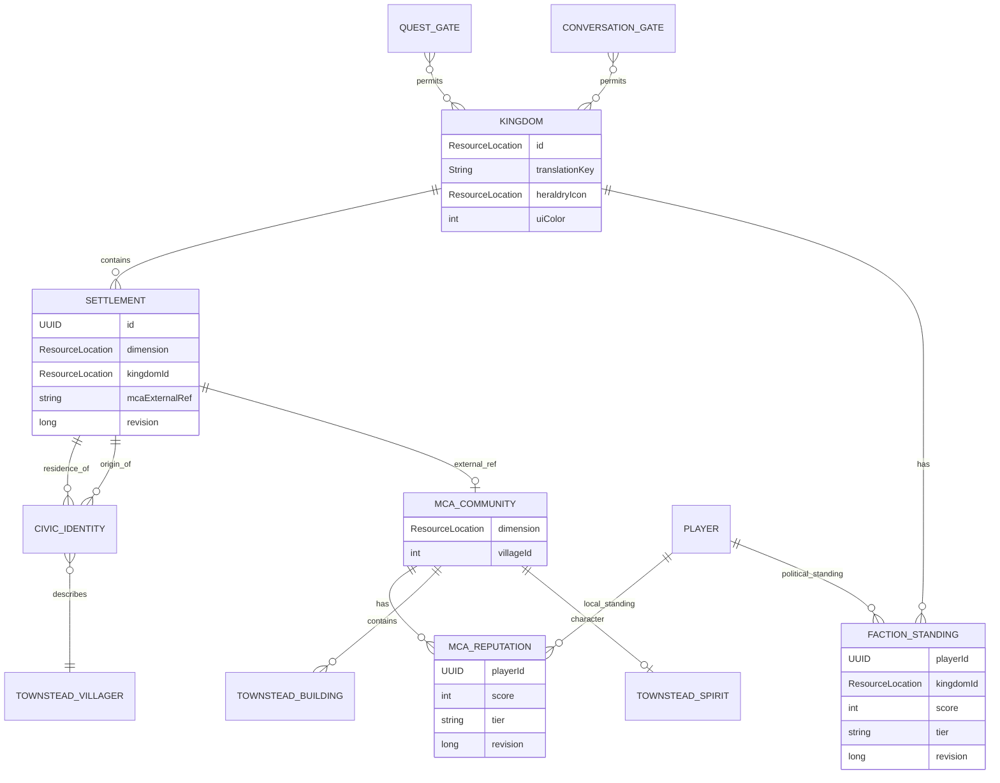
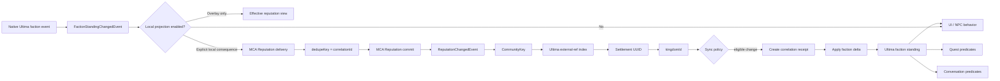
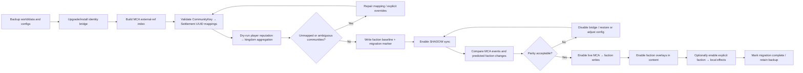

# UltimaKingdoms Compatibility Architecture for MCA Addons, Ultima Factions, and Townstead

## Executive Summary

The cleanest way to make **UltimaKingdoms** the geopolitical foundation for the MCA ecosystem is to treat each mod as the authority for a different scope rather than copying the same state into several places:

| Concern | Canonical authority | Integration rule |
|---|---|---|
| Kingdom identity | UltimaKingdoms | A settlement has one persistent `kingdomId`; all addons query it rather than reclassifying villages. |
| Settlement identity | UltimaKingdoms | Persistent UUID is the cross-mod civic identity; MCA village IDs are external references. |
| MCA operational village | MCA Reborn | Keep MCA village IDs/buildings/residency intact; do not replace MCA's village manager. |
| Personal relationship/hearts | MCA Reborn | Never infer political reputation directly from hearts. |
| Local public standing | MCA Reputation | `player + CommunityKey(dimension, villageId)` remains the authoritative village-level reputation ledger. |
| Kingdom/faction standing | Proposed Ultima Factions layer | `player + kingdomId` is a separate political scope, synchronized semantically with MCA Reputation rather than raw-score mirroring. |
| Quest state | MCA Quests | Ultima supplies eligibility predicates; Quests continues to own offers, acceptance, objectives, rewards, and lifecycle. |
| Conversation state | MCA Conversations | Ultima supplies kingdom predicates/context; Conversations continues to own its catalog, sessions, dispositions, and dialogue integration. |
| Villager simulation | Townstead | Townstead owns needs, schedules, profession progression, buildings, roots/genes, calendar, and local village spirit. |
| Political ownership | UltimaKingdoms / Ultima Factions | Townstead buildings inherit their settlement's political context; do not add a second Townstead kingdom field. |

That division already follows the philosophy of UltimaKingdoms. Its current release deliberately separates settlement, kingdom, residence, and origin and explicitly leaves reputation, kingdom-specific quests, diplomacy, warfare, and related mechanics for later layers. Its design notes also distinguish personal MCA relationships from future political standing. fileciteturn5file0L2-L2 fileciteturn17file0L2-L2

The important architectural finding is that **most of the required integration can be added through APIs and adapters without turning UltimaKingdoms into a hard dependency of the MCA addons**. UltimaKingdoms already exposes `KingdomsService`, immutable settlement/kingdom/civic views, detector/resolver/evidence extension points, revisions, and Forge events. MCA Quests already has a public custom-condition API, while MCA Conversations already registers safe custom dialogue conditions and has a central precedent—`TopicAgeGate`—for hiding catalog entries before the player can click them. fileciteturn11file0L2-L2 fileciteturn25file0L2-L2 fileciteturn42file0L2-L2 fileciteturn53file0L2-L2

The recommended implementation therefore has four major pieces:

1. **A reusable `KingdomPredicate`/`KingdomContextResolver` API** in UltimaKingdoms, or a very small integration library published beside it.
2. **Native kingdom predicates in MCA Quests and MCA Conversations**, with offer/menu-level gating rather than merely suppressing results after a button is already visible.
3. **A revisioned, exactly-once semantic bridge between MCA Reputation and Ultima Factions**, with each system authoritative for its own scope. A village score and a kingdom score should not be blindly kept numerically identical.
4. **A Townstead civic adapter** that maps Townstead's MCA `villageId` and buildings into the same Ultima settlement UUID, enriches quests/dialogue/behavior with needs, schedules, buildings, roots, calendar, and village spirit, while leaving Townstead in control of its own simulation and screen.

There is one material limitation in the available source set: **I did not locate a public `otectus/UltimaFactions` codebase or existing Ultima Factions API**. Current UltimaKingdoms explicitly says reputation/diplomacy are not implemented. Accordingly, the Ultima Factions API and persistence types below are an implementation specification for that missing/planned layer, not claims about classes that already exist. fileciteturn5file0L2-L2 The specification deliberately leaves room for Ultima Factions to become a separate mod or a module inside UltimaKingdoms.

For a concrete implementation baseline, the researched projects converge well around **Minecraft 1.20.1 / Forge / Java 17**. UltimaKingdoms currently targets Forge 47.x and an exact MCA 7.6.26 compatibility surface; MCA Quests and Conversations support broader MCA 7.6/7.7 lines; Townstead currently publishes a Forge 1.20.1 build at 0.7.6 and also supports 1.21.1/NeoForge. fileciteturn5file0L2-L2 citeturn6search1turn6search2turn6search3 Because the user requested no platform/version constraint, the architecture below keeps those runtime bridges optional and capability-based even though 1.20.1 Forge is the best first implementation target.

## Research Baseline and Code Inventory

UltimaKingdoms already contains nearly all of the identity primitives needed for this work. Its public service can query kingdoms and settlements, find a settlement at a position, query an entity's residence/civic identity, expose context, mutate settlement kingdom assignment, and register external settlement detectors, kingdom resolvers, and civic-evidence providers. `revision()` provides a natural cache invalidation epoch. fileciteturn11file0L2-L2

The highest-value source files for the coding agent are:

| Codebase | Key file/class | Why it matters |
|---|---|---|
| UltimaKingdoms | `com.ultimakingdoms.api.KingdomsService` | Primary server-side query/mutation surface: kingdoms, settlements, residence, civic identity, context, discovery, and extension registration. fileciteturn11file0L2-L2 |
| UltimaKingdoms | `SettlementView` | Immutable settlement identity: UUID, dimension, bounds, `kingdomId`, name, style, external refs, aliases, revisions. fileciteturn12file0L2-L2 |
| UltimaKingdoms | `KingdomView` | Kingdom definition: ID, translation key, name pool, heraldry icon, UI color, metadata. fileciteturn13file0L2-L2 |
| UltimaKingdoms | `CivicIdentityView` | Separates origin and residence settlement/kingdom, exactly what quest/dialogue scoping needs. fileciteturn14file0L2-L2 |
| UltimaKingdoms | `SettlementKingdomChangedEvent` | Cache invalidation and political-transition trigger. Carries settlement, old kingdom, new kingdom, reason. fileciteturn15file0L2-L2 |
| UltimaKingdoms | `CivicIdentityChangedEvent` | Invalidate villager/player civic-context caches when residence/origin changes. fileciteturn16file0L2-L2 |
| UltimaKingdoms | `SettlementSavedData` | Current schema-1 NBT store, global revision, settlement redirects, safe refusal on unsupported schemas. fileciteturn46file0L2-L2 |
| UltimaKingdoms | `compat.mca.McaAccess` | Critical interoperability mapping: MCA village becomes an Ultima settlement candidate with external ref key `"mca"` and value `<dimension>#<villageId>`. fileciteturn50file0L2-L2 |
| UltimaKingdoms | `compat.mca.McaCompat` | Existing exact-version, read-only MCA adapter and civic-residence integration. fileciteturn48file0L2-L2 |
| MCA Quests | `McaQuestsApi` | Registers custom quest conditions/objectives/rewards. Kingdom eligibility can be added without patching every quest path. fileciteturn25file0L2-L2 |
| MCA Quests | `QuestCondition` | Condition interface is simply `boolean test(QuestContext)`, ideal for a kingdom predicate adapter. fileciteturn22file0L2-L2 |
| MCA Quests | `QuestContext` | Supplies player, giver villager, quest data/id, MCA snapshot, level/day/RNG helpers. fileciteturn23file0L2-L2 |
| MCA Quests | `OfferFilters` / `QuestDefinition.effectiveConditions()` | Existing condition filtering is already used in the offer path, so kingdom gating belongs here naturally. fileciteturn26file0L1-L1 fileciteturn26file7L1-L1 |
| MCA Quests | `TownsteadBridge` | Existing soft-dependency seam with capability probing and read/write Townstead DTO operations. fileciteturn34file0L2-L2 |
| MCA Quests | `TownsteadVillagerView` | Townstead villager identity, life stage, personality, profession XP, needs/schedule, roots/genes/heritage. fileciteturn35file0L2-L2 |
| MCA Quests | `TownsteadBuildingView` | Maps building ID, MCA village ID, type, size, center and bounds. fileciteturn36file0L2-L2 |
| MCA Quests | `TownsteadCalendarView` | World calendar/date/season context. fileciteturn37file0L2-L2 |
| MCA Quests | `TownsteadSpiritView` | Existing addon-side model for village-character/spirit information. fileciteturn38file0L2-L2 |
| MCA Quests | `TownsteadCapability` | Fine-grained probing for reads/mutations instead of all-or-nothing Townstead integration. fileciteturn39file0L2-L2 |
| MCA Conversations | `TopicEntry` | Central machine-readable conversation catalog. Best place for an authored `kingdom_gate`. fileciteturn51file0L2-L2 |
| MCA Conversations | `TopicAgeGate` | Direct architectural precedent: result conditions cannot hide an already-clickable answer, so all entry paths use one pre-entry gate. fileciteturn53file0L2-L2 |
| MCA Conversations | `DynamicHub` | Already filters catalog slots based on topic eligibility; extend the same path for kingdom eligibility. fileciteturn52file1L13-L20 |
| MCA Conversations | `ConversationsMcaRegistrar` | Registers parse-safe custom dialogue conditions/actions and catches failures so malformed integration data does not break MCA's selection loop. fileciteturn42file0L2-L2 |
| MCA Conversations | `TownsteadBridge` | Existing soft boundary that explicitly leaves needs/schedules/professions/skills/buildings/spirit under Townstead authority. fileciteturn32file0L2-L2 |
| MCA Reputation | `McaReputationApi` | Canonical queries/mutations, snapshots, delivery/dedupe, titles, mirrors, imports, capability probing. fileciteturn19file0L2-L2 |
| MCA Reputation | `ReputationChangedEvent` | One post-commit event for deed, resolution, decay, admin/import, etc.; carries applied delta, source, cause, and quiet flag. fileciteturn45file0L2-L2 |
| MCA Reputation | `ReputationMirror` | Existing companion-mod mirror seam; an excellent model for Ultima Factions integration. fileciteturn19file3 |
| MCA Reputation | `ReputationSavedData` | Canonical world-global `<world>/data/mcareputation.dat`, format versioning, read-only downgrade protection, reconciliation and corruption quarantine strategy. fileciteturn43file0L2-L2 |
| MCA Reputation | `MIGRATION.md` | Existing migration semantics, idempotency, receipts, rollback, legacy Quests import, and safe removal/reinstallation behavior. fileciteturn44file0L2-L2 |
| Townstead | `com.aetherianartificer.townstead.api.TownsteadAPI` | Current stable read-only facade for entities, villagers, players, calendar, buildings, roots, genes. fileciteturn57file0L2-L2 |
| Townstead | `VillageSpiritCache`, `VillageSpiritAggregator`, `SpiritReconciler` | Local village-character system keyed around MCA village identity/building aggregation. fileciteturn58file0L1-L12 fileciteturn58file4L62-L72 |
| Townstead | Blueprint/village building code | Townstead works directly with MCA `VillageManager` and MCA `Building` collections, reinforcing MCA village ID as the bridge key. fileciteturn61file0L1-L20 |

Townstead now has a public GitHub source repository, and its current public API describes itself as a stable **read-only** integration facade. It exposes Townstead snapshots while still using MCA's `VillageManager`, `Village`, and `Building` internally. fileciteturn57file0L2-L2 Its public project documentation confirms that Townstead owns hunger/thirst/energy, farming, schedules/profession assignment, life stages/calendar, reactions, and related village simulation; Townstead 0.7.6 is currently available for Forge 1.20.1. citeturn7view0turn6search3

This means the existing reflection-based `TownsteadBridge` implementations in Quests/Conversations remain sensible compatibility boundaries, but they should increasingly resolve **Townstead's public API first** and only fall back to internal probes for capabilities the current read-only API does not expose, notably some spirit and mutation functionality. This preserves current version tolerance while reducing unnecessary dependence on Townstead internals. fileciteturn34file0L2-L2 fileciteturn32file0L2-L2 fileciteturn57file0L2-L2

## Canonical Data Model and Mapping

The central identity mapping is stronger than it initially appears: UltimaKingdoms already persists the exact MCA village identifier needed by MCA Reputation and Townstead.

`McaAccess.candidate(...)` constructs:

```text
externalRefs["mca"] = "<dimension-resource-location>#<MCA village id>"
```

for every MCA-backed settlement. fileciteturn50file0L2-L2

MCA Reputation's canonical community key is effectively:

```java
CommunityKey(
    ResourceLocation dimension,
    int villageId
)
```

and its standing is per player/per community rather than per villager. fileciteturn18file0L2-L2 fileciteturn19file0L2-L2

Townstead's `TownsteadBuildingSnapshot` likewise gets its `villageId` from the MCA village containing the building. fileciteturn57file0L2-L2

Consequently the canonical join is:

```text
MCA Reputation CommunityKey
      dimension + villageId
              │
              ▼
 "<dimension>#<villageId>"
              │
              ▼
 Ultima Settlement.externalRefs["mca"]
              │
              ▼
 Settlement UUID ──► kingdomId
              │
              ├──► Townstead buildings
              ├──► Townstead spirit
              └──► villager civic residence/origin
```

**Core field mapping**

| Semantic concept | UltimaKingdoms | MCA Reputation / MCA | MCA Quests / Conversations | Townstead | Mapping rule |
|---|---|---|---|---|---|
| Stable settlement | `SettlementView.id(): UUID` | No equivalent stable cross-mod UUID | Refer to giver/entity or community indirectly | No equivalent public civic UUID | Ultima UUID is canonical cross-mod settlement identity. fileciteturn12file0L2-L2 |
| MCA village | `externalRefs["mca"] = dim#id` | `CommunityKey(dimension,villageId)` | Giver's MCA home/community | `building.villageId` | Parse/format the same dimension + MCA integer ID. fileciteturn50file0L2-L2 |
| Kingdom | `SettlementView.kingdomId()` | None | New kingdom condition/context | None | Resolve through settlement; never infer from biome after initial classification. fileciteturn12file0L2-L2 |
| Origin | `CivicIdentityView.originSettlement/Kingdom` | None | Useful for heritage/origin dialogue | Townstead root/heritage is biological/cultural, not political | Keep origin kingdom and Townstead root separate. fileciteturn14file0L2-L2 fileciteturn35file0L2-L2 |
| Residence | `CivicIdentityView.residenceSettlement/Kingdom` | Villager's MCA home helps community resolution | Primary giver-side quest/dialogue scope | Villager simulation occurs in MCA/Townstead village | Residence kingdom should drive normal local content. fileciteturn14file0L2-L2 fileciteturn48file0L2-L2 |
| Player local standing | None today | `player UUID + CommunityKey → score/tier/incidents` | Existing rep conditions/rewards | None | MCA Reputation remains canonical. fileciteturn19file0L2-L2 |
| Player kingdom standing | Future | None | New condition/check input | None | `player UUID + kingdomId`; owned by Ultima Factions. |
| Personal affection | None | Not public standing | Conversations/MCA relationship systems | Townstead reactions may affect MCA hearts | Never map 1:1 to kingdom standing. Ultima's design explicitly anticipates political standing as independent. fileciteturn17file2 |
| Townstead building | Settlement contains its location; MCA ref identifies village | Same MCA village | Existing Townstead query/objective context | `id, villageId, type, size, center, bounds` | Convert `villageId` + level dimension → Settlement UUID. fileciteturn36file0L2-L2 |
| Townstead spirit | No equivalent | None | Can gate/flavor quests/dialogue | Village-local aggregate from buildings | Keep local; do not turn spirit into kingdom identity. fileciteturn38file0L2-L2 |
| Townstead root | No equivalent | None | Heritage-sensitive content | root/species/ancestry/lineage/genes | Root is population/biological identity, not kingdom allegiance. fileciteturn57file0L2-L2 |

A crucial implementation improvement should be made to `KingdomsService`: there is currently no first-class public lookup by external reference even though `SettlementView` exposes them. fileciteturn11file0L2-L2 fileciteturn12file0L2-L2 Do **not** let every integration scan all settlements to reverse-map a `CommunityKey`.

Add:

```java
public interface KingdomsService {
    Optional<SettlementView> getSettlementByExternalRef(
        String namespace,
        String externalRef
    );

    default Optional<SettlementView> getSettlementForMcaVillage(
        ResourceLocation dimension,
        int villageId
    ) {
        return getSettlementByExternalRef(
            "mca",
            dimension + "#" + villageId
        );
    }
}
```

Internally maintain:

```java
Map<ExternalRefKey, UUID> settlementByExternalRef;
record ExternalRefKey(String source, String value) {}
```

Build/rebuild that index during `SettlementSavedData` initialization and update it atomically when settlements are registered, merged, redirected, or external refs change. Since Ultima already maintains a global settlement `revision`, consumers can discard cached resolutions when that revision changes. fileciteturn46file0L2-L2

The relationship model should be formalized as follows:



The biggest semantic rule for the coding agent is:

> **A Townstead/MCA village, an Ultima settlement, and an Ultima kingdom are related entities, not aliases.**

That prevents several future bugs: merging MCA villages does not silently merge kingdoms; changing a settlement's kingdom does not rewrite Townstead roots; moving a villager changes residence but not origin; and local MCA standing does not suddenly become identical to kingdom-wide political standing.

## Kingdom Gating Design

The gating system should use **one predicate model** shared conceptually by Quests and Conversations, while each addon supplies its own lightweight adapter.

A proposed public model:

```java
public enum KingdomSubject {
    GIVER_RESIDENCE,
    GIVER_ORIGIN,
    PLAYER_LOCATION,
    GIVER_LOCATION,
    EXPLICIT_SETTLEMENT
}

public enum UnknownKingdomPolicy {
    DENY,
    ALLOW
}

public record KingdomPredicate(
    KingdomSubject subject,
    Set<ResourceLocation> include,
    Set<ResourceLocation> exclude,
    UnknownKingdomPolicy whenUnknown
) {
    public boolean matches(ResourceLocation kingdomId) {
        if (kingdomId == null) {
            return whenUnknown == UnknownKingdomPolicy.ALLOW;
        }
        if (exclude.contains(kingdomId)) {
            return false;
        }
        return include.isEmpty() || include.contains(kingdomId);
    }
}

public interface KingdomContextResolver {
    Optional<KingdomContext> resolve(
        ServerPlayer player,
        @Nullable Entity villager,
        KingdomSubject subject
    );
}

public record KingdomContext(
    UUID settlementId,
    ResourceLocation kingdomId,
    ResourceLocation dimension,
    long settlementRevision
) {}
```

The default should be **fail closed** (`DENY`) for an explicitly kingdom-gated piece of content. An unresolved MCA residence during world startup should not make a Lunari-only royal quest appear to everybody. Ungated content remains unaffected.

For normal villager-authored content, `GIVER_RESIDENCE` should be the default. `GIVER_ORIGIN` is appropriate for heritage/diaspora stories. `PLAYER_LOCATION` is useful for location-specific notices or border interactions, but should not normally decide what a resident villager culturally knows.

**Quest integration**

MCA Quests already lets addons register custom condition codecs, and `QuestCondition` receives both the player and the villager giver. fileciteturn25file0L2-L2 fileciteturn22file0L2-L2 That means kingdom gating belongs in an ordinary custom condition:

```java
public final record KingdomQuestCondition(
    KingdomPredicate predicate
) implements QuestCondition {

    public static final Codec<KingdomQuestCondition> CODEC =
        KingdomPredicate.CODEC.xmap(
            KingdomQuestCondition::new,
            KingdomQuestCondition::predicate
        );

    @Override
    public boolean test(QuestContext context) {
        return UltimaKingdomsBridge.instance()
            .resolve(
                context.player(),
                context.villager(),
                predicate.subject()
            )
            .map(ctx -> predicate.matches(ctx.kingdomId()))
            .orElse(predicate.whenUnknown() == UnknownKingdomPolicy.ALLOW);
    }

    @Override
    public Component describe() {
        return Component.translatable(
            "condition.mcaquests.kingdom"
        );
    }
}
```

Registration:

```java
McaQuestsApi.registerCondition(
    new ResourceLocation("ultima_kingdoms", "kingdom"),
    KingdomQuestCondition.CODEC
);
```

This should occur through the same setup path used by other external Quests conditions. The existing offer filters already evaluate `effectiveConditions()`, so the gate naturally affects offer discovery rather than forcing a separate patch into the UI. fileciteturn26file0L1-L1

**Quest lifecycle policy is important.** Kingdom conditions should default to **offer-time and acceptance-time eligibility**, not continuously invalidate an already accepted quest. Otherwise a political reassignment or villager relocation can strand a player's quest midway through an objective.

At acceptance, capture:

```java
public record KingdomBindingSnapshot(
    UUID settlementId,
    ResourceLocation kingdomId,
    long settlementRevision
) {}
```

Store it with the accepted quest only when the definition asks for a binding. Recommended modes:

| Mode | Behavior |
|---|---|
| `OFFER_ONLY` | Gate offer and acceptance; accepted quest survives later changes. **Default.** |
| `BOUND_AT_ACCEPT` | Objective/reward logic continues using kingdom at acceptance. Best for story chains. |
| `LIVE` | Re-resolve kingdom whenever checked. Use only for intrinsically political state such as “while Bellmeadow remains Lunari-controlled.” |
| `FAIL_ON_CHANGE` | Explicitly fails/cancels if kingdom changes. Rare; must provide player-visible reason. |

When `SettlementKingdomChangedEvent` fires, invalidate only cached eligibility. Do **not** iterate every player's accepted quests unless the quest explicitly uses `LIVE`/`FAIL_ON_CHANGE`. The event provides exactly the old/new kingdom needed for this invalidation. fileciteturn15file0L2-L2

**Conversation integration requires two layers, not one.**

A tempting solution is just to register:

```json
"conversations_kingdom": {
  "include": ["ultima_kingdoms:lunari"]
}
```

as a custom MCA result condition. That is necessary for **branch-level** kingdom dialogue, but insufficient for entire-topic gating.

MCA Conversations already documents this exact structural issue in `TopicAgeGate`: MCA's answer constraint vocabulary cannot understand arbitrary catalog metadata, while custom conditions are evaluated on results after an answer has already become visible/clickable. Therefore age eligibility is enforced before entry across GUI, packets, numbered choices, chat, and the dynamic hub. fileciteturn53file0L2-L2

Kingdom eligibility should use the same architecture.

Extend `TopicEntry`:

```java
public record TopicEntry(
    String id,
    String entryQuestion,
    String entryAnswer,
    DepthClass depth,
    String returnQuestion,
    Set<AgeGroup> ages,
    Set<StanceFamily> requiredStanceFamilies,
    boolean chatRequired,
    Optional<Arc> arc,
    Set<String> milestones,
    Map<String, Set<String>> exclusiveGroups,
    Optional<KingdomTopicGate> kingdomGate
) {}
```

Add:

```java
public final class TopicKingdomGate {
    public static boolean allows(
        ConversationCatalog catalog,
        String question,
        String answer,
        Entity villager,
        ServerPlayer player
    ) {
        if (catalog == null || question == null || answer == null) {
            return true;
        }

        return catalog.byStarter(question, answer)
            .flatMap(TopicEntry::kingdomGate)
            .map(gate -> KingdomBridge.instance()
                .resolve(player, villager, gate.subject())
                .map(ctx -> gate.matches(ctx.kingdomId()))
                .orElse(gate.allowUnknown()))
            .orElse(true);
    }
}
```

Then replace independent age checks with a composite:

```java
public final class TopicGate {
    public static boolean allows(
        String question,
        String answer,
        Entity villager,
        ServerPlayer player
    ) {
        return TopicAgeGate.allows(question, answer, villager)
            && TopicKingdomGate.allows(
                ConversationCatalogLoader.active(),
                question,
                answer,
                villager,
                player
            );
    }
}
```

Every existing `TopicAgeGate` call site should be converted to `TopicGate`, because the current design intentionally funnels direct packets, numbered choice, chat mode and dynamic-hub entry through the age guard. fileciteturn53file0L2-L2 fileciteturn52file1L13-L20

Separately register a result condition following `ConversationsMcaRegistrar`'s safe parser pattern:

```java
McaHandles.registerCondition(
    "conversations_kingdom",
    (json, name) -> SafeParse.orNull(
        "conversations_kingdom",
        json,
        () -> ConversationKingdomQuery.fromJson(json)
    ),
    query -> (villager, stack, player) -> {
        try {
            if (query == null || player == null) {
                return 0.0f;
            }

            return KingdomBridge.instance()
                .resolve(player, villager, query.subject())
                .filter(ctx -> query.matches(ctx.kingdomId()))
                .isPresent()
                    ? 1.0f
                    : 0.0f;
        } catch (Throwable t) {
            McaConversations.LOGGER.debug(
                "conversations_kingdom failed; defaulting 0",
                t
            );
            return 0.0f;
        }
    }
);
```

That deliberately mirrors Conversations' existing rule that parser/runtime integration failures fail safely rather than taking down MCA's dialogue reload/selection path. fileciteturn42file0L2-L2

**Proposed topic JSON**

```json
{
  "entry": {
    "question": "village",
    "answer": "ask_about_moon_festival"
  },
  "depth": "medium",
  "return_question": "village",
  "ages": ["teen", "adult"],
  "required_stance_families": ["curious", "exit"],
  "kingdom_gate": {
    "subject": "giver_residence",
    "include": [
      "ultima_kingdoms:lunari"
    ],
    "exclude": [],
    "when_unknown": "deny"
  }
}
```

**Branch-level result JSON**

```json
{
  "conditions": {
    "conversations_kingdom": {
      "subject": "giver_origin",
      "include": ["ultima_kingdoms:madera"],
      "when_unknown": "deny"
    }
  },
  "say": "dialogue.mcaconversations.madera.remembers_home"
}
```

The result-level predicate allows a Madera-born resident of Lunari to talk differently about home without hiding an otherwise common topic.

A recommended JSON Schema for the common predicate is:

```json
{
  "$schema": "https://json-schema.org/draft/2020-12/schema",
  "$id": "https://ultimakingdoms.example/schema/kingdom-gate.schema.json",
  "type": "object",
  "properties": {
    "subject": {
      "type": "string",
      "enum": [
        "giver_residence",
        "giver_origin",
        "giver_location",
        "player_location",
        "explicit_settlement"
      ],
      "default": "giver_residence"
    },
    "include": {
      "type": "array",
      "items": {
        "type": "string",
        "pattern": "^[a-z0-9_.-]+:[a-z0-9_/.-]+$"
      },
      "uniqueItems": true,
      "default": []
    },
    "exclude": {
      "type": "array",
      "items": {
        "type": "string",
        "pattern": "^[a-z0-9_.-]+:[a-z0-9_/.-]+$"
      },
      "uniqueItems": true,
      "default": []
    },
    "when_unknown": {
      "enum": ["deny", "allow"],
      "default": "deny"
    }
  },
  "additionalProperties": false
}
```

Validation should reject a kingdom resource ID that is malformed, but it should **warn rather than hard-fail merely because a referenced kingdom is not currently registered**, since modpacks can add/remove datapacks and optional kingdoms. The resolved runtime predicate still fails closed by default.

Useful edge cases are:

| Edge case | Required behavior |
|---|---|
| Villager has no residence | Gate is unresolved; explicit gate defaults to deny. |
| Settlement exists but kingdom definition was removed | Treat as missing/unknown kingdom; log once. |
| Villager just moved kingdoms | `CivicIdentityChangedEvent` invalidates context; next offer/menu reflects new residence. fileciteturn16file0L2-L2 |
| Settlement is reassigned | `SettlementKingdomChangedEvent` invalidates eligibility; accepted `OFFER_ONLY` quest stays valid. fileciteturn15file0L2-L2 |
| Conversation packet bypasses GUI | Server-side `TopicGate` still rejects entry. |
| Chat text directly matches gated topic | Same `TopicGate`; no bypass through chat. |
| Townstead UI hosts conversation | Gate is server-owned; Townstead presentation cannot bypass it. |
| Ultima absent | Bridge is no-op; ungated content works, explicitly Ultima-gated content should be unavailable rather than silently global unless pack author chooses `when_unknown=allow`. |
| Datapack reload changes a gate | Reload replaces catalog predicates atomically; no mutation of durable conversation progress. |

## Reputation and Ultima Factions Synchronization

MCA Reputation's design is already much more suitable for interoperability than a simple “reputation integer” would be. It owns a world-global canonical save, models reputation per player/per MCA community, tracks incidents and dedupe receipts, reconciles decay, posts `ReputationChangedEvent` for all forms of score movement, exposes snapshots and capability probing, and provides a `ReputationMirror` API specifically for keeping a companion representation synchronized. fileciteturn19file0L2-L2 fileciteturn43file0L2-L2 fileciteturn45file0L2-L2

The critical design decision is **not to make a village reputation score and a kingdom faction score the same record**.

A local village can regard a player differently from the wider state. Ultima's own design explicitly anticipates kingdom reputation as independent of MCA personal relations, and the same separation should extend to local-village versus kingdom-wide public standing. fileciteturn17file2

The recommended target model for Ultima Factions is:

```java
public record FactionKey(ResourceLocation kingdomId) {}

public record FactionStandingSnapshot(
    UUID playerId,
    FactionKey faction,
    int score,
    ResourceLocation ladderId,
    String tierId,
    String highWaterTierId,
    long revision
) {}

public enum FactionChangeCause {
    LOCAL_REPUTATION,
    FACTION_DEED,
    DIPLOMACY,
    QUEST,
    ADMIN,
    IMPORT,
    DECAY,
    MIGRATION
}
```

A minimal future API should look like:

```java
public interface UltimaFactionsService {
    int apiVersion();

    Optional<FactionStandingSnapshot> getStanding(
        UUID player,
        ResourceLocation kingdomId
    );

    FactionStandingResult apply(
        FactionStandingRequest request
    );

    Optional<PoliticalRelationView> relation(
        ResourceLocation first,
        ResourceLocation second
    );

    long revision();

    Registration registerMirror(FactionStandingMirror mirror);
}
```

and a request should carry provenance explicitly:

```java
public record FactionStandingRequest(
    UUID playerId,
    ResourceLocation kingdomId,
    int delta,
    ResourceLocation source,
    FactionChangeCause cause,
    UUID correlationId,
    long sourceRevision,
    Optional<UUID> settlementId,
    Optional<String> description,
    boolean quiet
) {}
```

The bridge should be **event-based and exactly-once**, not “once per tick compare two integers and overwrite the smaller one.”



**Why raw bidirectional mirroring is unsafe**

MCA Reputation has local-community decay, incident histories, resolutions/supersession, score clamps, migration baselines, and exactly-once delivery semantics. fileciteturn43file0L2-L2 A faction system may later have treaties, war, citizenship, offices, kingdom-wide decrees, or its own decay. If both sides simply do:

```text
MCA changed → set faction score to MCA score
Faction changed → set every MCA village score to faction score
```

then:

* one local deed overwrites unrelated kingdom history;
* kingdom changes fan out into every village;
* MCA decay can cause a faction update which writes back into MCA and effectively decays twice;
* joining a kingdom with many settlements can multiply score;
* settlement reassignment retroactively rewrites political history;
* event listeners can create infinite feedback loops.

Instead, implement **canonical ownership per scope plus semantic projections**.

Recommended default:

```text
MCA Reputation:
    source of truth for local village standing and local incident history

Ultima Factions:
    source of truth for kingdom-wide political standing

MCA -> Faction:
    eligible local applied deltas contribute to faction standing

Faction -> MCA:
    normally exposed as an overlay/context, not copied into every local ledger

Explicit faction-wide gameplay effect:
    can create an MCA synthetic incident in the currently affected settlement,
    with a stable dedupe/correlation id
```

This produces a useful combined value without corrupting either ledger:

```java
public record EffectiveStanding(
    int localScore,
    int factionScore,
    int factionModifier,
    int effectiveScore
) {}

int effective =
    clamp(
        localScore +
        projection.toLocalModifier(factionScore)
    );
```

The local `ReputationSnapshot` remains unchanged. The effective value is used only where a content author explicitly selects `scope = effective`.

Recommended content scopes:

```text
local        MCA Reputation only
faction      Ultima Factions only
effective    local + bounded faction overlay
either       pass if either specified condition succeeds
both         require both
```

That enables content such as:

```json
{
  "kingdom": "ultima_kingdoms:lunari",
  "standing": {
    "scope": "faction",
    "min": 150
  }
}
```

and:

```json
{
  "standing": {
    "scope": "local",
    "min": 75
  }
}
```

without pretending the two things mean the same thing.

**Score transformation should be configurable.** Do not assume Ultima Factions will forever share MCA Reputation's numerical bounds. Introduce:

```java
public interface StandingProjection {
    int localDeltaToFactionDelta(
        int localDelta,
        ReputationSnapshot local,
        FactionStandingSnapshot faction
    );

    int factionScoreToLocalModifier(
        int factionScore
    );
}
```

A conservative default can be:

```text
MCA local delta → faction delta: 50% rounded away from zero
Faction → effective-local modifier: bounded to ±50
```

The exact numbers are game-balance config, not API constants.

**Change filtering**

`ReputationChangedEvent` includes the applied delta, source, cause, and quiet/background flag. fileciteturn45file0L2-L2 The bridge should make causes configurable:

| MCA change cause | Default faction propagation |
|---|---|
| Deed | Yes |
| Quest reward | Yes if it ultimately reports as an ordinary source/deed change |
| Resolution | Yes; propagate the actual reverse/adjustment |
| Supersede | Yes through resulting applied change |
| Decay | Configurable; recommended **No** initially |
| Admin set | No unless `syncAdmin=true` |
| Import | No during live sync; migration handles it deliberately |
| Migration | No |
| Reload/reconciliation | Follow only if it contains a real applied delta and policy permits it |

The bridge also must reject events whose `source.namespace` is its own namespace when they represent a reverse projection:

```java
if (event.source().equals(ULTIMA_FACTIONS_SYNC_SOURCE)) {
    return; // loop prevention
}
```

That check is necessary but not sufficient. Persist correlation receipts as well.

Recommended receipt:

```java
public record SyncReceipt(
    UUID correlationId,
    SyncDirection direction,
    UUID playerId,
    ResourceLocation sourceScope,
    ResourceLocation targetScope,
    long sourceRevision,
    long targetRevision,
    long gameTime
) {}
```

Use a bounded retention horizon just as MCA Reputation uses receipts for duplicate deliveries. MCA Reputation's current migration specifically synthesizes receipts for old dedupe keys so replayed operations do not become duplicate deeds. fileciteturn43file0L2-L2

**Preferred MCA → Ultima listener**

```java
@SubscribeEvent
public static void onReputationChanged(ReputationChangedEvent event) {
    if (!SyncConfig.mcaToFaction()) {
        return;
    }
    if (!CAUSE_POLICY.propagates(event.cause())) {
        return;
    }
    if (event.delta() == 0) {
        return;
    }
    if (event.source().equals(Ids.ULTIMA_SYNC_SOURCE)) {
        return;
    }

    KingdomsService kingdoms = UltimaKingdomsApi.get(server);

    Optional<SettlementView> settlement =
        kingdoms.getSettlementForMcaVillage(
            event.community().dimension(),
            event.community().villageId()
        );

    if (settlement.isEmpty()) {
        MissingMappingQueue.record(event);
        return;
    }

    ResourceLocation kingdom =
        settlement.get().kingdomId();

    UUID correlation = event.incidentId()
        .orElseGet(() -> Correlations.forStandingChange(
            event.playerId(),
            event.community(),
            event.oldScore(),
            event.newScore(),
            event.cause()
        ));

    if (receipts.contains(correlation, MCA_TO_FACTION)) {
        return;
    }

    int delta = projection.localDeltaToFactionDelta(
        event.delta(),
        /* local snapshot */,
        /* faction snapshot */
    );

    FactionStandingResult result =
        factions.apply(new FactionStandingRequest(
            event.playerId(),
            kingdom,
            delta,
            Ids.MCA_REPUTATION,
            FactionChangeCause.LOCAL_REPUTATION,
            correlation,
            /* sourceRevision */,
            Optional.of(settlement.get().id()),
            Optional.empty(),
            event.quiet()
        ));

    receipts.record(...);
}
```

`ReputationChangedEvent` does not itself expose the `StandingChange.revision` described by the broader API, so the production bridge should prefer a `ReputationMirror` implementation if revision-accurate replication is required. The existing mirror's `mirrorStanding(StandingChange)` shape is specifically suitable for this. fileciteturn19file3

Recommended adapter:

```java
public final class UltimaFactionReputationMirror
        implements ReputationMirror {

    @Override
    public void mirrorStanding(StandingChange change) {
        synchronizer.onLocalStandingChanged(change);
    }

    @Override
    public void mirrorTitleState(
        UUID player,
        TitleSnapshot state,
        long revision
    ) {
        titleSynchronizer.reconcile(player, state, revision);
    }
}
```

MCA Reputation already uses `mirrorTitleState` as an authoritative reconciliation mechanism after title changes and login, which is preferable to hoping every individual event was observed. fileciteturn19file1

**Settlement kingdom changes**

Do not automatically transfer previously earned faction standing when a settlement changes kingdom.

Store `kingdomIdAtEvent` on projected faction contributions:

```java
record LocalContribution(
    UUID correlationId,
    UUID settlementId,
    ResourceLocation kingdomIdAtEvent,
    int factionDelta,
    long gameTime
) {}
```

Default policy:

```text
Settlement switches Lunari -> Madera:
    historical Lunari contributions remain Lunari history
    future local deeds contribute to Madera
    local MCA village reputation remains unchanged
```

This is the least surprising treatment of history and avoids one settlement's conquest causing every player's kingdom score to mutate.

Provide optional policies for specialized modpacks:

```toml
[reputationSync]
settlementReassignmentPolicy = "FREEZE_HISTORY"
# FREEZE_HISTORY
# REPROJECT_ACTIVE_BASELINE
# MIGRATE_ALL_CONTRIBUTIONS  <-- advanced/dangerous
```

**Persistence specification**

If Ultima Factions is separate, use:

```text
<world>/data/ultima_factions.dat
```

If it is implemented inside UltimaKingdoms:

```text
<world>/data/ultima_kingdoms_factions.dat
```

Suggested NBT shape:

```text
Schema: int
Revision: long

Players: {
  "<player uuid>": {
    Factions: [
      {
        Kingdom: "ultima_kingdoms:lunari",
        Score: 125,
        Tier: "trusted",
        HighWaterTier: "honored",
        Revision: 42
      }
    ]
  }
}

SyncReceipts: [
  {
    Correlation: <UUID>,
    Direction: "MCA_TO_FACTION",
    Player: <UUID>,
    SourceScope: "...",
    TargetScope: "...",
    SourceRevision: 991,
    TargetRevision: 42,
    GameTime: 12345678
  }
]
```

Follow MCA Reputation's save-safety model: explicit schema number, idempotent forward migrations, no gameplay events during schema conversion, backup documentation, and a **read-only latch on a save format newer than the running build** rather than destructively rewriting unknown data. MCA Reputation currently implements those protections in `ReputationSavedData` and documents rollback as restoring a pre-upgrade backup. fileciteturn43file0L2-L2 fileciteturn44file0L2-L2

**Performance**

This integration should require effectively zero recurring world scans:

```text
on settlement registration/load
    build external-ref index

on reputation/faction commit
    process one event

on settlement kingdom/civic change
    invalidate affected caches

on player login
    reconcile authoritative snapshots once

on datapack reload
    rebuild definitions/predicates, not player data
```

Never poll every villager or every settlement every tick merely to synchronize scores.

## Townstead Integration Design

Townstead should make the combined system feel like one coherent settlement simulation without becoming the owner of political state.

Townstead's current public API exposes villager state, schedules/needs/profession data, calendar, building lookup, roots and genes. Its building lookup resolves an MCA `Village`, iterates MCA buildings, and returns the MCA `villageId`; that makes the existing MCA-village → Ultima-settlement bridge the correct joining mechanism. fileciteturn57file0L2-L2

The intended ownership stack should be:

```text
Ultima Kingdom / Faction
        │ political authority
        ▼
Ultima Settlement UUID
        │ civic identity
        ▼
MCA Village ID
        │ operational village
        ├───────────────┐
        ▼               ▼
Townstead Buildings   MCA Reputation Community
        │               │
        ▼               ▼
Village Spirit       Local public standing
        │
        ▼
Needs / schedules / professions / local behavior
```

This avoids a dangerous anti-pattern: adding `townsteadKingdom`, `mcaKingdom`, and `ultimaKingdom` fields and then trying to synchronize all three.

**Town ownership**

Political ownership should live in Ultima:

```java
SettlementView.kingdomId()
```

Townstead should ask:

```java
Optional<SettlementView> settlementFor(
    ServerLevel level,
    int townsteadVillageId
)
```

implemented as:

```java
return kingdoms.getSettlementForMcaVillage(
    level.dimension().location(),
    townsteadVillageId
);
```

A change of political ownership therefore changes the kingdom banner, faction access, guard/quest/dialogue behavior, and political UI immediately while **not** destroying or reassigning Townstead farms, kitchens, docks, schedules, professions, roots, or spirit.

That distinction is particularly valuable because Townstead treats buildings and village simulation as MCA-village-local state. fileciteturn57file0L2-L2 fileciteturn61file0L1-L20

**UI integration**

MCA Conversations already intentionally preserves Townstead's ownership of its RPG dialogue screen and adds only compatible number badges/input behavior. citeturn6search0 Follow that precedent everywhere.

For Townstead's Blueprint/village UI, add a compact optional civic header rather than replacing Townstead's layout:

```text
┌──────────────────────────────────────────────┐
│ [Lunari heraldry] Bellmeadow                  │
│ Kingdom of Lunari · Standing: Honored        │
│ Local character: Scholarly / Industrious ... │
├──────────────────────────────────────────────┤
│ Townstead's normal Blueprint UI              │
│ ...                                          │
└──────────────────────────────────────────────┘
```

Data sources:

```java
KingdomView kingdom = kingdoms.getKingdom(settlement.kingdomId());
FactionStandingSnapshot factionStanding = ...
ReputationSnapshot localStanding = ...
TownsteadSpiritView localSpirit = ...
```

Do not duplicate palette definitions where possible: Ultima's `KingdomView` already carries heraldry icon and UI color. fileciteturn13file0L2-L2

If Townstead has no stable UI extension hook for the desired screen, keep the mixin:

* client-only;
* optional/soft-failing;
* presentation-only;
* unable to mutate canonical civic state;
* version-probed separately from server functionality.

A failed Townstead UI injection must never disable quest/reputation synchronization.

**NPC behavior**

NPC behavior can become substantially richer by combining political and Townstead context without taking over Townstead's AI.

Examples:

```text
Lunari librarian + WORK shift + high Energy
    → may offer archive/census/astronomy kingdom quest

Madera farmer + Hunger low village-wide
    → offers emergency harvest/supply quest

Anemosia courier + REST shift
    → refuses routine delivery work, but emergency dispatch remains possible

Foreign player + hostile faction standing
    → guard conversation becomes terse
    → ordinary domestic Townstead behavior remains unchanged

Resident whose origin kingdom != residence kingdom
    → diaspora conversation branch
    → no change to profession or daily schedule
```

Townstead's public villager snapshot includes life stage, biological/apparent age, immortality/seniority, personality, profession and profession XP, schedule, needs, carried variants, expressed alleles and heritage. fileciteturn57file0L2-L2 The existing MCA addon DTO already models these same domains, so the integration layer can remain stable even if Townstead's internal class names move. fileciteturn35file0L2-L2

The rule should be:

> Ultima supplies **political intent and eligibility**; Townstead remains authoritative for whether the villager is asleep, working, exhausted, hungry, collapsed, professionally qualified, etc.

Do not overwrite schedules to make kingdom flavor happen.

**Townstead building interactions**

Townstead buildings are particularly useful as *quest-generating civic infrastructure*.

Proposed examples:

| Townstead building family | Kingdom-aware gameplay |
|---|---|
| Farm / field | food quota, drought relief, seed exchange, wartime provisioning |
| Kitchen / cook facility | royal feast, famine relief, diplomatic banquet |
| Library / archive | census, genealogy, historical records, kingdom lore |
| Smithy | guard equipment, ceremonial arms, public works |
| Dock | trade manifest, fishing levy, foreign arrivals, smuggling investigations |
| Market | tax collection, inter-kingdom trade, shortages |
| Temple / shrine | local spirit + kingdom religious/cultural content |
| Guard/barracks | security patrol, border alert, faction hostility |
| Large civic structure | unlock kingdom chapter, title ceremony, settlement-upgrade quest |

Because `TownsteadBuildingView` provides `family()`/level-like building semantics in the MCA Quests bridge and includes village ID/bounds, quest logic should bind to **building family + settlement UUID**, not a fragile block position alone. fileciteturn36file0L2-L2

Suggested binding:

```java
public record BoundCivicBuilding(
    UUID settlementId,
    int townsteadBuildingId,
    String family,
    String typeAtBinding
) {}
```

On reload:

1. resolve settlement by UUID;
2. resolve Townstead village from settlement's `mca` ref;
3. find building by ID;
4. verify family/type if objective requires it;
5. if missing, apply objective policy: `WAIT`, `REBIND_SAME_FAMILY`, or `FAIL_WITH_REASON`.

Never persist a Townstead object or Java class name.

**Quest spawning**

Compose conditions rather than creating a second quest engine:

```text
Quest eligible =
    ordinary MCA Quests conditions
    AND kingdom gate
    AND faction/local-standing gate, if authored
    AND Townstead capability gate, if authored
    AND Townstead building/needs/schedule predicate, if authored
```

Example conceptual content:

```json
{
  "id": "pack:lunari_archive_inventory",
  "conditions": [
    {
      "type": "ultima_kingdoms:kingdom",
      "subject": "giver_residence",
      "include": ["ultima_kingdoms:lunari"]
    },
    {
      "type": "mcaquests:townstead_available",
      "capabilities": [
        "read_villager",
        "read_schedule",
        "read_building"
      ]
    },
    {
      "type": "mcaquests:townstead_query",
      "source": "building",
      "target": "nearest",
      "path": "family",
      "operator": "eq",
      "value": "library"
    }
  ]
}
```

The exact container syntax should follow the active MCA Quests quest schema, but the important design is that Ultima's condition is just another member of the existing effective-condition pipeline. MCA Quests already treats Townstead as optional and capability-oriented. fileciteturn39file0L2-L2

For event-driven “a new building just unlocked a quest” behavior, prefer a future Townstead public listener/event API:

```java
public record TownsteadBuildingChangedEvent(
    ResourceLocation dimension,
    int villageId,
    int buildingId,
    ChangeType change
) {}
```

If no stable event exists, do not install an unrestricted every-tick scan. Use a bounded reconciliation service for **active/loaded settlements only**, for example every 200 ticks, and hash the small building identity set:

```java
record BuildingFingerprint(
    int id,
    String type,
    int size
) {}
```

When a fingerprint changes, emit an internal integration event and let Quests decide whether an offer becomes available.

**Village spirit**

Townstead has a village-spirit system backed by building aggregation/cache machinery. fileciteturn58file0L1-L12 fileciteturn58file4L62-L72 Treat it as **local culture/character**, not kingdom classification.

This enables combinations such as:

```text
Kingdom = Lunari
Spirit  = Mercantile
→ cosmopolitan moon-market dialogue

Kingdom = Lunari
Spirit  = Scholarly
→ observatory/archive dialogue

Kingdom = Madera
Spirit  = Agrarian
→ harvest rites

Kingdom = Madera
Spirit  = Martial
→ frontier militia culture
```

That produces far richer settlements than making every Lunari village mechanically identical.

A useful content predicate would be:

```json
{
  "all": [
    {
      "kingdom": ["ultima_kingdoms:lunari"]
    },
    {
      "townstead_spirit": {
        "primary": ["scholarly", "mystic"],
        "min_tier": 2
      }
    }
  ]
}
```

**Reactions and conversations**

The Conversations bridge already exposes Townstead reaction dispatch and dialogue-open/close seams while explicitly keeping Townstead authoritative for its own simulation. fileciteturn32file0L2-L2 Use kingdom/faction outcomes to choose semantic reaction IDs:

```java
townstead.fireReaction(
    level,
    villager,
    player,
    new ResourceLocation(
        "ultima_kingdoms",
        "foreign_dignitary_respected"
    ),
    Set.of(
        "kingdom:lunari",
        "standing:honored",
        "context:conversation"
    )
);
```

Townstead can then animate/emote according to its own reaction system without Ultima depending on animation internals. Townstead publicly describes reactions as datapack-configurable and personality-sensitive, making this a natural integration boundary. citeturn7view0

**Save/load rules**

Persist only stable foreign identifiers:

```text
Ultima:
    settlement UUID
    kingdom ResourceLocation
    MCA external ref

Quest:
    quest id
    accepted kingdom snapshot if required
    settlement UUID
    optional Townstead building integer id/family

Faction sync:
    player UUID
    kingdom ResourceLocation
    settlement UUID when relevant
    correlation/revision receipts
```

Re-query volatile Townstead state after load. Needs, current shift, building snapshots, spirit, and calendar should not be duplicated into Ultima save data. Townstead already owns those values through its own systems/public snapshots. fileciteturn57file0L2-L2

## Implementation, Migration, Testing, and Risk

The following backlog is ordered so that later work is built on stable identity rather than adding compatibility hacks first.

| Priority | Task | Effort | Acceptance criterion |
|---|---|---:|---|
| P0 | Add `getSettlementByExternalRef()` and indexed MCA-community lookup to UltimaKingdoms | S | `CommunityKey(dim,id)` resolves to the same Ultima settlement without scanning all settlements. |
| P0 | Create shared `KingdomPredicate`, subjects, unknown policy and resolver | M | Pure unit tests cover include/exclude/origin/residence/location/unresolved cases. |
| P0 | Create optional `UltimaKingdomsBridge` in MCA Quests | S | Quests starts normally with Ultima absent; bridge reports capability when present. |
| P0 | Register `ultima_kingdoms:kingdom` quest condition | M | Same quest appears in allowed kingdom and never in denied kingdom. |
| P0 | Add kingdom reference validation/lint | S | Bad resource syntax errors clearly; absent optional kingdom warns without crashing. |
| P0 | Add Conversations optional Ultima bridge | S | No direct mandatory Ultima classload when absent. |
| P0 | Extend `TopicEntry` with optional `kingdom_gate` | M | Existing catalogs parse identically; new field round-trips/lints. |
| P0 | Replace entry-path `TopicAgeGate` calls with composite `TopicGate` | L | GUI, chat, direct packet, numbered-choice and dynamic-hub paths all agree. |
| P0 | Register parse-safe `conversations_kingdom` result condition | M | Branch-level kingdom dialogue works and malformed query fails closed. |
| P0 | Add server-side direct-entry bypass tests | M | Crafted packet/chat path cannot enter hidden kingdom topic. |
| P1 | Specify/implement `UltimaFactionsService` and persistent faction standing | L | Per-player/per-kingdom snapshots survive restart with schema/revision. |
| P1 | Add external-ref → faction mapping adapter | M | MCA community resolves deterministically to settlement/kingdom. |
| P1 | Implement MCA Reputation `ReputationMirror` bridge | L | One applied MCA change creates exactly one eligible faction update. |
| P1 | Add correlation receipts and origin-loop prevention | M | Bidirectional test runs thousands of changes with no recursive amplification. |
| P1 | Add faction→effective-local overlay | M | Quests/Conversations can independently request local/faction/effective standing. |
| P1 | Implement read-only shadow synchronization mode | M | Operators can compare projected faction score without writes. |
| P1 | Implement dry-run migration command/report | M | Reports all mappings/unmapped communities/conflicts and writes nothing. |
| P1 | Implement faction baseline import | L | Idempotent, restart-safe, no duplicate events/rewards. |
| P2 | Update Quests Townstead bridge to prefer public Townstead API where possible | M | 0.7.x public read surfaces work without probing equivalent internals. |
| P2 | Update Conversations Townstead bridge similarly | M | Existing behavior preserved; capability status explains fallbacks. |
| P2 | Add Townstead building→Ultima settlement adapter | S | Building's `villageId` resolves to correct settlement/kingdom. |
| P2 | Add civic building binding/rebind policies | M | Bound quests survive restart and handle removed/replaced buildings predictably. |
| P2 | Add kingdom/faction context to Townstead-aware quest/content predicates | M | Composable kingdom + schedule + building + spirit examples pass. |
| P2 | Add optional Blueprint civic header/badge | L | Townstead screen remains functional if UI hook misses; server logic unaffected. |
| P2 | Add reaction tags for political events | M | Townstead reactions consume semantic event IDs without Ultima touching animation internals. |
| P3 | Add building-change public event upstream to Townstead, if accepted | M | Removes need for reconciliation polling. |
| P3 | Add public Townstead spirit snapshot API | M | Quests/Conversations no longer need internal spirit reflection. |
| P3 | Cross-loader abstraction for 1.21.1 NeoForge | L | Core predicate/sync modules remain loader-neutral; loader events are adapters. |

**Recommended migration**

Do not turn on live two-way synchronization immediately in an established world. Use a staged migration with explicit rollback points.



The MCA Reputation project itself uses the right migration principles to copy here: migration is idempotent; markers are written after successful mutation; duplicate operation keys are receipt-backed; newer unknown formats are protected rather than overwritten; operators are told to back up world data before format upgrades. fileciteturn44file0L2-L2

For an existing player with local reputation in several settlements of one kingdom, **do not sum all village scores** when constructing the initial faction baseline. Five +100 villages should not automatically become +500 merely because a kingdom has five settlements.

Recommended default baseline:

```java
int importedFactionBaseline(
    List<Integer> localScores
) {
    if (localScores.isEmpty()) return 0;

    return Math.round(
        (float) localScores.stream()
            .mapToInt(Integer::intValue)
            .average()
            .orElse(0.0)
    );
}
```

Make this strategy configurable:

```toml
[migration]
legacyAggregation = "MEAN"
# MEAN      recommended
# MEDIAN    good for outlier resistance
# MAX       preserves best local relationship
# MIN       strict political interpretation
# SUM       available but strongly discouraged
```

Keep a report showing the inputs and result for every player/kingdom.

A baseline import should not fabricate incident history. That mirrors MCA Reputation's own legacy Quests migration: old scores that lacked player-specific/deed history become baseline standing instead of invented incidents. fileciteturn44file0L2-L2

**Proposed integration configuration**

`config/ultima_kingdoms-integrations-common.toml`:

```toml
[kingdomGating]
enabled = true
unknownKingdomPolicy = "DENY"
cacheBySettlementRevision = true

[reputationSync]
enabled = true
mode = "SHADOW"
# OFF
# SHADOW
# MCA_TO_FACTION
# BIDIRECTIONAL_SEMANTIC

localDeltaContribution = 0.50
propagateDecay = false
propagateAdminChanges = false
factionOverlayMax = 50
receiptRetentionTicks = 12096000
settlementReassignmentPolicy = "FREEZE_HISTORY"

[townstead]
enabled = true
preferPublicApi = true
allowReflectiveFallback = true
buildingReconcileIntervalTicks = 200
enableBlueprintCivicHeader = true
enablePoliticalReactions = true
```

Shared datapack gate definitions can optionally be supported at:

```text
data/<namespace>/ultima_kingdoms/kingdom_gates/<id>.json
```

Example:

```json
{
  "schema": 1,
  "subject": "giver_residence",
  "include": [
    "ultima_kingdoms:lunari",
    "ultima_kingdoms:yew"
  ],
  "exclude": [
    "ultima_kingdoms:anemosia"
  ],
  "when_unknown": "deny"
}
```

Then Quests/Conversations can reference:

```json
{
  "gate": "my_pack:northern_scholars"
}
```

instead of duplicating long allow-lists. Inline predicates should remain available for small cases.

**Unit tests**

The minimum pure-unit suite should cover:

| Test | Expected result |
|---|---|
| `KingdomPredicate_includeMatch` | Included kingdom passes. |
| `KingdomPredicate_includeMiss` | Non-included kingdom fails. |
| `KingdomPredicate_excludeWins` | Exclusion overrides inclusion. |
| `KingdomPredicate_emptyIncludeMeansAny` | Any known kingdom passes unless excluded. |
| `KingdomPredicate_unknownDefaultsDeny` | Missing context fails. |
| `KingdomPredicate_unknownExplicitAllow` | Explicit compatibility fallback passes. |
| `McaExternalRef_roundTrip` | `dimension + villageId` maps to current Ultima format and back. |
| `ExternalRefIndex_redirect` | Merged/redirected settlement resolves canonical UUID. |
| `QuestKingdomCondition_residence` | Giver residence kingdom controls condition. |
| `QuestKingdomCondition_origin` | Origin can differ from residence and resolves independently. |
| `TopicEntry_parsesKingdomGate` | New catalog schema loads. |
| `TopicGate_ageAndKingdom` | Both gates are ANDed. |
| `TopicGate_unknownEntryPasses` | Non-catalog MCA answers remain untouched. |
| `ConversationKingdomQuery_badJsonFailsClosed` | Bad custom condition cannot break reload. |
| `ReputationCommunity_mapsSettlement` | Community joins through `externalRefs["mca"]`. |
| `ReputationSync_appliesOnce` | Same correlation ID produces one faction change. |
| `ReputationSync_loopPrevention` | Reverse-origin event does not echo. |
| `ReputationSync_zeroClampedDeltaIgnored` | MCA clamp resulting in zero produces no faction change. |
| `ReputationSync_causePolicy` | Decay/admin/import obey config. |
| `ReputationSync_reassignmentFreezesHistory` | Old contribution remains old kingdom after political reassignment. |
| `FactionMigration_meanNotSum` | Multiple local scores do not multiply baseline. |
| `FactionMigration_idempotent` | Second migration is no-op. |
| `FactionSave_roundTrip` | Player/faction/receipt state survives exact NBT round trip. |
| `FactionSave_futureVersionReadOnly` | Newer format is not overwritten. |
| `TownsteadBuilding_mapsSettlement` | `villageId` maps to same Ultima settlement. |
| `TownsteadBuilding_missingRebind` | Policy correctly waits/rebinds/fails. |
| `TownsteadAbsent_noClassload` | Addons start without Townstead classes. |
| `UltimaAbsent_noClassload` | MCA addons start without Ultima classes. |

MCA Reputation already has extensive examples worth mirroring for this work: migration, golden-save, dedupe/receipt, reconciliation, tier, networking, and SavedData tests are already present in that repository. fileciteturn20file0L2-L2

**Integration/GameTests**

High-value in-game tests:

| Scenario | Verification |
|---|---|
| Two villages, two kingdoms | Same giver profession; Lunari-only quest appears only in Lunari. |
| Runtime kingdom reassignment | Reopen quest screen after `setKingdom`; offer changes immediately. |
| Accepted quest during reassignment | Existing `OFFER_ONLY` quest remains completable. |
| Conversation hub | Lunari-only topic is entirely absent in Madera. |
| Direct-choice exploit | Client sending hidden answer index/packet is rejected server-side. |
| Chat bypass | Typing matching intent cannot enter gated topic. |
| Origin/residence split | Madera-born Lunari resident gets residence content plus origin-specific branch. |
| MCA reputation deed | One deed changes local rep and yields exactly one configured kingdom contribution. |
| Server restart | Replaying old event/correlation does not duplicate faction standing. |
| Reputation decay | Obeys configured propagation and never forms a loop. |
| Settlement transfer | Local MCA score stays; future faction contributions use new kingdom. |
| Townstead kitchen | Building-aware kingdom quest becomes eligible only in correct settlement. |
| Townstead schedule | Sleeping/resting villager does not improperly offer work content. |
| Townstead collapsed need state | Emergency vs routine quest policy behaves as authored. |
| Townstead building deletion | Bound quest applies configured recovery behavior. |
| Townstead UI absent/changed | Failed optional client hook does not affect dedicated server. |
| Mod removal | MCA Quests/Conversations continue functioning without Ultima/Townstead integration content. |
| Datapack reload | Kingdom gate updates without corrupting accepted quests or conversation progression. |

UltimaKingdoms already notes that some MCA integration is better verified in production-style runtime testing because upstream MCA mixin/remapping behavior can make ordinary ForgeGradle game-test environments unreliable; MCA Conversations similarly separates pure CI/binding probes from production client/server checks. fileciteturn5file0L2-L2 citeturn6search0 The final release gate should therefore include a real dedicated-server + client testpack, not just unit tests.

**Compatibility matrix**

| Combination | Expected status | Notes |
|---|---|---|
| UltimaKingdoms only | Full | No MCA/Townstead/faction behavior required. |
| MCA Quests only | Full | Existing behavior unchanged. |
| MCA Conversations only | Full | Existing behavior unchanged. |
| MCA Reputation only | Full | Canonical local standing unchanged. |
| Townstead only with MCA | Full | Ultima integration not required. |
| Ultima + MCA Quests | Full after P0 | Kingdom-gated quest offers. |
| Ultima + MCA Conversations | Full after P0 | Topic and branch-level kingdom gating. |
| Ultima + MCA Reputation | Full after P1 | Community→settlement→kingdom mapping and faction projection. |
| Ultima + Townstead | Strong after P2 | Buildings/civic UI/culture integration via MCA village identity. |
| Quests + Townstead | Already substantially integrated | Existing capability bridge should be retained. fileciteturn34file0L2-L2 |
| Conversations + Townstead | Already substantially integrated | Townstead retains UI/simulation authority. fileciteturn32file0L2-L2 |
| Quests + Reputation | Existing integration/migration model | MCA Reputation is canonical and Quests can mirror/fallback. fileciteturn44file0L2-L2 |
| All mods, 1.20.1 Forge | **Primary recommended first target** | Common researched platform; biggest current issue is Ultima's exact MCA 7.6.26 adapter. fileciteturn48file0L2-L2 |
| MCA 7.7 with current Ultima | **Risk / currently not equivalent to addon support** | Quests/Conversations support broader MCA lines, while current Ultima adapter explicitly targets exact 7.6.26. fileciteturn48file0L2-L2 |
| Townstead 0.7.5–0.7.6 | Preferred | Existing addon bridges are designed around this current line; 0.7.6 Forge 1.20.1 is publicly released. citeturn6search3 |
| 1.21.1 NeoForge | Later port | Townstead supports it, but Ultima's researched codebase is 1.20.1 Forge-focused. citeturn6search2 |

**Risk assessment**

| Risk | Severity | Probability | Mitigation |
|---|---:|---:|---|
| No located existing Ultima Factions API | High | Certain for this research baseline | Treat faction layer as an explicit new API/module; do not fabricate dependence on nonexistent classes. |
| Ultima's MCA adapter is exact-version 7.6.26 | High | High | Replace exact-version monolith with capability/binding probes similar to the MCA Addons; keep civic API MCA-free. fileciteturn48file0L2-L2 |
| Village vs kingdom reputation scope mismatch | High | High | Dual ledger + semantic projections; never raw-score two-way mirroring. |
| Feedback loops between reputation systems | High | Medium | Source tags + correlation receipts + source revisions + idempotent delivery. |
| Hidden conversation still clickable | High | High if only result condition is added | Extend `TopicAgeGate` architecture to a composite pre-entry `TopicGate`. fileciteturn53file0L2-L2 |
| Political reassignment rewrites history | High | Medium | Persist `kingdomIdAtEvent`; default `FREEZE_HISTORY`. |
| Save downgrade/corruption | High | Low–Medium | Versioned schema, read-only future-format latch, backups, quarantine/idempotent migration patterned after MCA Reputation. fileciteturn43file0L2-L2 |
| Townstead API/internal churn | Medium–High | Medium | Public-API-first capability bridge, reflection fallback, DTO boundary, optional client mixins. |
| Townstead UI mixin collision | Medium | Medium | Presentation-only soft injection; Townstead keeps screen ownership. |
| Excessive settlement/reputation scanning | Medium | Medium if naively implemented | External-ref index, event-driven sync, revision caches; no global tick scans. |
| Datapack removes a kingdom referenced by content | Medium | Medium | Validate/warn on reload; runtime fail-closed; never corrupt persistent quests. |
| Building disappears during active quest | Medium | Medium | Stable binding IDs with `WAIT/REBIND/FAIL` policy. |
| Mod removal | Medium | Medium | Never serialize optional mod Java types; soft adapters and fallback behavior. |
| Same kingdom content becomes repetitive | Gameplay risk | High | Combine kingdom identity with Townstead spirit, profession, schedule, origin and local reputation instead of using kingdom alone. |

The architectural end state should therefore be **federated rather than merged**: UltimaKingdoms answers *where and under whom*, MCA Reputation answers *what this particular community thinks of this player*, Ultima Factions answers *what the kingdom thinks politically*, MCA Quests and Conversations decide *what content is available*, and Townstead answers *what this village and villager are actually doing and what kind of place it has become*. That separation matches the strongest existing APIs in all of the researched codebases and gives a coding agent a path to implement the requested compatibility without introducing duplicate authorities or irreversible save coupling.